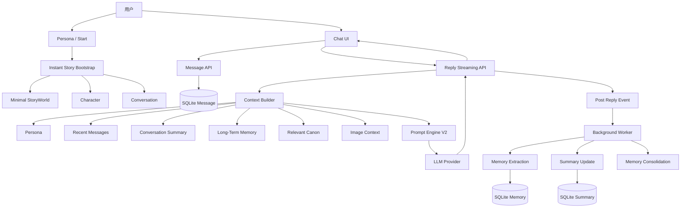

# GameStart 即时故事系统 V2.1 全新整改与后续开发方案

> 文档类型：整改 + 二阶段开发规划  
> 适用范围：`feat/instant-story-chat-prompt-engine` / PR #18 之后  
> 当前阶段：快速开发 / Chat Core Stabilization  
> 核心目标：先把“Persona → Chat → Streaming → Image → Memory”做成稳定主链路，再继续扩展结构化故事能力。

---

# 1. 方案定位

本方案不是继续在当前第一版上机械追加功能，而是重新确定接下来一个阶段的开发重点：

```text
第一版已经完成：
Persona
→ Instant Story
→ Conversation
→ Chat
→ Prompt Engine
→ Streaming

下一阶段重点：
稳定 Chat Core
→ 真正支持图片理解
→ 修正上下文管理
→ 完成 Long-Term Memory
→ 最后再接 Story Structuring
```

接下来不再追求“功能数量”，而追求：

> 每一个已经暴露给用户的功能，都必须形成真实、完整、可长期运行的数据闭环。

---

# 2. 当前版本判断

当前第一版已经建立正确的整体方向：

```text
Web
→ API
→ Chat Use Case
→ Prompt Engine
→ LLM
→ SQLite
```

并且已经具备：

- Persona 单入口
- Instant Story 创建
- StoryWorld / Character / Conversation
- Chat Message
- SSE Streaming
- Chat Media 数据模型
- Memory 数据模型
- Memory FTS5
- Prompt Engine 基础
- Chat Web 页面
- 基础 CI

因此：

> 不需要推翻当前架构。

真正需要做的是：

```text
修核心 Bug
+
补全已经存在但未完成的链路
+
重新控制下一阶段范围
```

---

# 3. 新的阶段目标

本阶段最终必须做到：

```text
用户输入一个 Persona
→ 进入 Chat
→ AI 自动开场
→ 用户发送文本
→ AI 流式回复
→ 用户发送图片
→ AI 真正理解图片
→ 长时间持续聊天
→ 系统记住重要信息
→ 重启应用后仍可恢复
```

同时保证：

```text
50 Turn
100 Turn
500 Turn
```

之后仍然能正确使用：

- 最近消息
- Session Summary
- Long-Term Memory
- Persona
- Canon
- 图片

而不会随着聊天增长逐渐失效。

---

# 4. 本阶段暂时不做

以下功能全部延后：

- Chat → Canon 自动写入
- Chat → Narrative Graph
- Story Analyzer
- Memory Vector Database
- Qdrant 强依赖
- 多角色群聊
- Agent Tool Calling
- Voice Chat
- 视频
- 自动世界生成
- 自动 Timeline
- 自动 Relationship Graph
- Prompt 可视化编排
- Prompt Marketplace

原因：

> 这些功能都建立在稳定 Chat + Context + Memory 之上。

核心聊天链路没有稳定前，继续增加能力只会放大技术债。

---

# 5. 新的目标架构



---

# 6. 核心设计原则

## 6.1 Chat 是最短同步链路

用户发送消息：

```text
Save User Message
→ Build Context
→ Prompt Engine
→ LLM
→ Stream
→ Save Assistant Message
```

任何以下能力都不得阻塞用户回复：

- Memory Extraction
- Summary
- Canon Candidate
- Graph
- Timeline
- Story Analysis

## 6.2 Background Worker 只处理异步任务

Worker：

```text
Memory Extract
Memory Consolidate
Conversation Summary
Story Analyze
Scene Generation
Asset Generation
```

实时 Chat：

```text
不经过 Redis
不经过 Worker
```

## 6.3 Context 必须是有界的

不能：

```text
聊天越久
→ Prompt 越长
```

必须始终保持：

```text
Persona
+
Summary
+
Relevant Memory
+
Recent Messages
+
Current Input
```

## 6.4 Persona 是长期最高优先级上下文

Persona：

```text
永远保留
永远不由 Summary 替代
永远不由 Memory 覆盖
```

---

# 7. Phase 0：Chat Core Stabilization

这是下一步最高优先级。

建议单独建立：

```text
PR: fix/chat-core-stabilization
```

在这个 PR 完成前，不开发 Memory Extraction。

---

# 8. P0-1：修复 Chat Media Hash

统一：

```text
contentHash = 64 位 SHA256 hex
```

禁止：

```text
sha256:<hash>
```

数据库只保存纯 hex。

## 验收

真实测试：

```text
POST image
→ 201
→ media record
→ file exists
→ GET media
→ bytes identical
```

测试：

- PNG
- JPEG
- WebP
- GIF
- 假 PNG
- MIME 不一致
- 空文件
- 超过 12 MB
- 非图片文件

---

# 9. P0-2：修复 Recent Messages

Message Repository 增加：

```ts
listRecentByConversation(
  conversationId,
  limit
)

listPageByConversation(
  conversationId,
  cursor,
  limit
)
```

Prompt Context 禁止继续使用 `ORDER BY ASC LIMIT N`。

推荐：

```sql
SELECT *
FROM (
    SELECT *
    FROM v2_chat_messages
    WHERE conversation_id = ?
    ORDER BY created_at DESC, message_id DESC
    LIMIT ?
)
ORDER BY created_at ASC, message_id ASC;
```

Chat UI 第一版最低要求：

```text
Prompt：最近 40 条
UI：最近 200 条
```

后续增加向上滚动历史分页。

---

# 10. P0-3：Current Turn 去重

重新定义：

```ts
interface PromptContext {
  recentMessages: ChatMessageContext[];
  currentInput?: ChatInput;
}
```

严格保证：

```text
recentMessages = 当前用户消息之前的历史
currentInput = 本轮最新用户消息
```

禁止当前消息同时出现两次。

推荐：

```text
Get Current User Message
+
ListBefore(currentMessageId, 40)
```

---

# 11. P0-4：消息幂等

新增：

```ts
findByIdempotencyKey(
  conversationId,
  idempotencyKey
)
```

SendMessage：

```text
收到请求
↓
查询 idempotencyKey
↓
存在 → 返回原 Message
不存在 → Create
```

相同 key + 不同 payload：

```text
409 IDEMPOTENCY_CONFLICT
```

---

# 12. P0-5：Opening 幂等

首次开场固定：

```text
story-bootstrap:<conversationId>
```

这样多 Tab、刷新、Retry 都只能产生一个 Opening。

---

# 13. P0-6：Stop Generation 真正终止

目标：

```text
点击 Stop
→ Browser Abort
→ API 感知断开
→ Server AbortController
→ Provider Abort
→ Save interrupted
```

Provider 接口支持：

```ts
stream({
  messages,
  signal
})
```

有部分输出：

```text
status = interrupted
```

完全没有输出：

```text
不保存 Assistant Message
```

---

# 14. Phase 1：Prompt Engine V2

Core Stabilization 完成后，立即整改 Prompt Engine。

Prompt Engine 只负责：

```text
Structured Context
→ Context Selection
→ Budget
→ Template Assembly
→ PreparedPrompt
```

不负责数据库、HTTP、Provider、Memory Write、Message Save。

---

# 15. 新 PromptContext

```ts
interface PromptContext {
  task: PromptTask;
  persona: PersonaContext;
  world?: WorldContext;
  canon: readonly CanonContextItem[];
  memories: readonly MemoryContext[];
  sessionSummary?: ConversationSummaryContext;
  recentMessages: readonly ChatMessageContext[];
  currentInput?: ChatInput;
  tokenBudget: number;
  outputReserve: number;
}
```

---

# 16. Token Budget V2

计算：

```text
modelContextWindow
-
outputReserve
=
inputBudget
```

上下文优先级：

```text
Level 0
Platform Rules
Persona
Current Input

Level 1
Recent Messages

Level 2
Relevant Memory
Relevant Canon

Level 3
Session Summary

Level 4
Background Context
```

改为动态分配：

```text
放必须项
→ 放最近消息
→ 放高相关 Memory
→ 放 Canon
→ 放 Summary
→ Budget 用尽即停止
```

---

# 17. Token Estimate V2

中文不能继续统一按 `length / 4`。

第一版采用保守估算：

```text
CJK ≈ 1～1.1 token / char
ASCII ≈ 1 token / 4 chars
```

未来 Provider 有 tokenizer 时再换成精确计数。

---

# 18. Prompt 消息结构

最终：

```text
SYSTEM
├ Platform Rules
├ Persona
├ World
├ Canon
├ Memory
└ Summary

History Message 1
History Message 2
...
History Message N

Current User Message
```

Recent Messages 只出现一次。

---

# 19. Prompt Debug

PreparedPrompt 增加：

```ts
interface PromptBudgetDebug {
  totalBudget;
  usedTokens;
  personaTokens;
  canonTokens;
  memoryTokens;
  summaryTokens;
  recentMessageTokens;
  currentInputTokens;
}
```

同时记录：

- templateId
- templateVersion
- contextHash
- selectedMemoryIds
- selectedCanonIds
- recentMessageCount
- imageCount

---

# 20. Phase 2：真正的 Image Chat

上传图片与 AI 理解图片必须是两件明确的能力。

不要继续只传：

```ts
imageCount
```

改成：

```ts
interface ImagePromptInput {
  mediaId: V2MediaId;
  mediaRef: string;
  mimeType: string;
}

interface ChatInput {
  text?: string;
  images: readonly ImagePromptInput[];
}
```

历史 Message 同样保存 image context。

---

# 21. Media Resolver

新增：

```text
V2ChatMediaResolver
```

职责：

```text
mediaRef
→ validate
→ load file
→ provider image content
```

Prompt Engine 不直接读文件。

---

# 22. Model Capability

正式增加：

```ts
V2ModelCapability = {
  CHAT: "chat",
  SCENE_GENERATION: "scene_generation"
}
```

Model Profile 增加：

```ts
inputModalities: ["text", "image"]
```

支持 Vision：

```text
text + image → Provider
```

不支持：

```text
VISION_NOT_SUPPORTED
```

不能再用 `[图片 × 1]` 假装模型看到了图片。

---

# 23. Vision 验收

```text
用户发送一张猫图片
→ Provider 真正收到 image content
→ AI 能描述图片
```

同时测试不支持图片的模型。

---

# 24. Phase 3：Long-Term Memory V1

只有在 Chat Core、Prompt Engine V2、Image Chat 稳定后再开始。

完整链路：

```text
Conversation
↓
每 4 个 User Turns
↓
Memory Extraction Job
↓
Worker
↓
memory.extract.v1
↓
Structured JSON
↓
Validation
↓
Dedup
↓
Save
```

---

# 25. Memory Extract

输出：

```json
{
  "memories": [
    {
      "kind": "preference",
      "content": "用户不喜欢香菜",
      "importance": 0.7,
      "confidence": 0.95,
      "sourceMessageIds": ["message:..."]
    }
  ]
}
```

只记录长期有价值的信息：

- 用户身份信息
- 用户偏好
- 角色关系
- 重大共同经历
- 世界长期事实

---

# 26. Memory Retrieval V2

第一阶段：

```text
SQLite FTS5
+
importance
+
confidence
+
recency
```

流程：

```text
FTS 候选 20
→ Rank
→ Top 8
→ Prompt
```

权重放到 Retrieval Policy，不放 Domain。

---

# 27. Memory Supersede

例如：

```text
旧：
用户喜欢咖啡

新：
用户现在戒咖啡
```

处理：

```text
Old.status = superseded
New.status = active
New.supersedesMemoryId = Old.id
```

---

# 28. Phase 4：Conversation Summary

超过一定未摘要消息数量后后台生成：

```text
Previous Summary
+
Next Messages
→ summary prompt
→ New Summary
```

建议初始阈值：

```text
30～40 条未摘要消息
```

Summary 负责历史压缩。

Memory 负责长期事实。

两者保持独立。

---

# 29. 稳定后的最终 Context

每轮模型调用固定为：

```text
Platform Rules
+
Persona
+
Relevant Canon
+
Relevant Memory
+
Session Summary
+
Recent 20～30 Messages
+
Current Message
+
Images
```

总长度不随总聊天数线性增长。

---

# 30. Phase 5：Model / Prompt Observability

每次 Chat 调用记录：

```text
traceId
conversationId
messageId
task

templateId
templateVersion
contextHash

provider
model

inputTokens
outputTokens

memoryIds
canonIds

recentMessageCount
imageCount

firstTokenLatency
totalLatency

status
errorCode
```

---

# 31. Model Capability 重新划分

建议：

```text
chat
memory_extraction
story_analysis
scene_generation
```

以后可以：

```text
Chat → 快速高质量模型
Memory Extraction → 低成本模型
Story Analysis → 强推理模型
```

---

# 32. Provider 配置统一

Chat Route 不再硬编码：

```text
temperature = 0.8
maxTokens = 1024
```

使用：

```text
Model Profile
→ Resolved Model Config
→ Provider
```

Profile：

- temperature
- maxTokens
- timeout
- inputModalities

---

# 33. Phase 6：产品 UX 调整

技术主链稳定后，将 Instant Story 真正变成主产品入口。

建议：

```text
/v2
→ /v2/start
```

或：

```text
存在历史 Story
→ Recent Stories

不存在
→ /v2/start
```

---

# 34. Shell 拆分

建议：

```text
V2StoryShell
```

用于：

```text
/v2/start
/v2/chat/*
```

高级创作：

```text
V2AuthoringShell
```

用于：

```text
/v2/workspace/*
```

聊天页不要默认展示复杂创作后台导航。

---

# 35. Start 页继续简化

默认只保留：

```text
Persona
[开始故事]
```

角色名称放：

```text
高级选项
```

或后续自动推断。

---

# 36. Phase 7：Chat → Structured Story

最后再开发：

```text
Messages
+
Memory
+
Summary
↓
Story Analyzer
↓
Candidates
```

Candidates：

- Character Fact
- World Fact
- Timeline
- Relationship
- Graph

全部必须先进入 Candidate Review。

禁止自动覆盖 Canon。

---

# 37. 数据库调整

现有表保留：

```text
v2_conversations
v2_chat_messages
v2_chat_media
v2_memories
v2_conversation_summaries
```

后续补充外键：

```text
conversation.primary_character_id → character

message.reply_to_message_id → message

memory.conversation_id → conversation
memory.character_id → character
memory.supersedes_memory_id → memory
```

Migration 必须兼容现有开发数据库。

---

# 38. Repository API

Conversation：

```ts
create()
get()
listRecent()
touchLastMessage()
```

Message：

```ts
create()
get()
findByIdempotencyKey()
listRecentByConversation()
listBefore()
```

Media：

```ts
create()
get()
getByHash()
listByIds()
```

Memory：

```ts
create()
get()
searchActive()
findSimilar()
supersede()
forget()
touchAccess()
```

Summary：

```ts
get()
save()
```

---

# 39. API 规划

```text
POST /api/v2/instant-stories

GET  /api/v2/chat/conversations
GET  /api/v2/chat/conversations/:id

GET  /api/v2/chat/conversations/:id/messages
POST /api/v2/chat/conversations/:id/messages

POST /api/v2/chat/conversations/:id/replies

POST /api/v2/chat/media
GET  /api/v2/chat/media/:filename
```

是否增加独立 `/stop` API，可根据 Provider Abort 实现决定；如果 HTTP 连接关闭即可正确 Abort，则无需额外 API。

---

# 40. Retry

失败消息：

```text
Retry
↓
同一个 User Message
↓
新的 Assistant Reply Attempt
```

第一阶段实现 Retry。

Regenerate 放后续。

---

# 41. 错误码统一

```text
MODEL_NOT_CONFIGURED
PROVIDER_TIMEOUT
PROVIDER_RATE_LIMIT
PROVIDER_ERROR

VISION_NOT_SUPPORTED

MEDIA_TOO_LARGE
UNSUPPORTED_MEDIA
INVALID_MEDIA_REF

CONVERSATION_NOT_FOUND
MESSAGE_NOT_FOUND

IDEMPOTENCY_CONFLICT

PROMPT_BUDGET_EXCEEDED

MEMORY_EXTRACTION_FAILED
```

---

# 42. 测试策略

重点覆盖：

```text
真实用户路径
+
数据一致性
+
高风险上下文逻辑
```

不要求为了覆盖率制造无意义测试。

---

# 43. Prompt Engine P0 测试

必须验证：

```text
Current Input 只出现一次
Persona 永远保留
Recent Messages 正确裁剪
Memory 按 Budget 裁剪
Prompt 不超过 Budget
Context Hash 稳定
```

---

# 44. Repository P0 测试

自动插入：

```text
500 messages
```

验证：

```text
listRecent(40)
=
461～500
```

而不是：

```text
1～40
```

同时测试：

```text
Idempotency Replay
Idempotency Conflict
```

---

# 45. Chat Integration

完整：

```text
Create Instant Story
→ Opening
→ Send Text
→ Streaming Reply
→ Retry
→ Stop
→ Upload Image
→ Send Image
→ Read History
→ Restart API
→ Continue
```

---

# 46. Vision Integration

Fake Provider 必须直接检查：

```text
request.messages
```

图片 Message 必须真正包含 image content，而不是只有 `[图片 × 1]`。

---

# 47. Memory E2E

第一轮：

```text
User：
我的生日是 3 月 12 日。
```

Extraction 后：

```text
Memory：
用户生日是 3 月 12 日
```

重启。

下一轮：

```text
User：
你还记得我的生日吗？
```

验证 Prompt 中出现对应 Memory。

---

# 48. 性能目标

本地操作参考目标：

```text
Create Instant Story < 500ms
Context Build < 100ms
Memory Search < 50ms
Message Save < 20ms
```

LLM Provider 延迟不算入这些基础指标。

---

# 49. 推荐 PR 顺序

| PR | 目标 |
|---|---|
| PR1 `fix: stabilize v2 chat core` | 修 Media、Recent、幂等、Stop、长对话 |
| PR2 `refactor: harden v2 prompt engine context budgeting` | Prompt Engine V2 |
| PR3 `feat: add real multimodal vision chat` | 真正图片理解 |
| PR4 `feat: add long-term memory extraction and retrieval` | Long-Term Memory V1 |
| PR5 `feat: add conversation summarization` | 长对话压缩 |
| PR6 `feat: make instant story the primary product flow` | Chat-first 产品入口 |
| PR7 `feat: derive structured story candidates from chat` | Chat → Canon / Graph |

---

# 50. 普通 PR Required Checks

保持轻量：

```text
Architecture Boundaries
Typecheck
Unit Tests
Lint
Build
```

Chat Core 相关 PR 增加：

```text
Chat Integration Test
```

不要重新把：

```text
Real Redis
Full E2E
Real LLM
ComfyUI
```

变成所有 PR 的 Required。

---

# 51. 进入 Memory 开发前的 Gate

必须全部满足：

```text
Media Upload ✅
Recent Message ✅
Current Turn 去重 ✅
Prompt Budget ✅
Message Idempotency ✅
Opening Idempotency ✅
Stop Generation ✅
50 Turn Chat ✅
Restart Recovery ✅
```

然后才进入：

```text
Long-Term Memory
```

---

# 52. 进入 Story Analyzer 前的 Gate

必须满足：

```text
500 Turn Chat ✅

Memory Extraction ✅
Memory Retrieval ✅
Memory Supersede ✅

Session Summary ✅

Prompt Context Stable ✅

Vision Chat ✅
```

再开始：

```text
Chat → Canon / Graph
```

---

# 53. 最终产品路径

```text
打开 GameStart
↓
输入 Persona
↓
开始故事
↓
AI Opening
↓
长期聊天
├ Text
├ Image
└ Streaming
↓
长期 Memory
↓
Session Summary
↓
世界逐渐生长
↓
后台 Story Analyze
↓
需要时进入高级创作
```

---

# 54. 最终系统职责

```text
Chat
= 实时互动

Prompt Engine
= 上下文组装

Memory
= 长期记忆

Summary
= 历史压缩

Canon
= 正式世界事实

Story Analyzer
= 从聊天提取结构化候选

Worker
= 后台异步处理

SQLite
= 唯一业务事实源

Redis
= 可重建异步任务基础设施
```

---

# 55. 核心验收路径

以后不要用“写了多少模块”判断完成度。

使用这一条路径：

```text
Fresh DB
↓
Persona
↓
Opening
↓
Text Chat
↓
Image Chat
↓
Stop / Retry
↓
50 Turn
↓
Restart
↓
Continue
↓
Memory Works
↓
500 Turn
↓
Context Remains Stable
```

这条路径稳定后，再扩展复杂 Story System。

---

# 56. 最终执行原则

> 先把 Chat 做成一个能够长期运行的产品，再把复杂 Story System 建立在 Chat 之上。

后续开发统一遵守：

```text
Chat First
Context Bounded
Memory Async
Structure Lazy
User Path First
```

这五条原则应成为 GameStart 下一阶段的核心开发准则。
