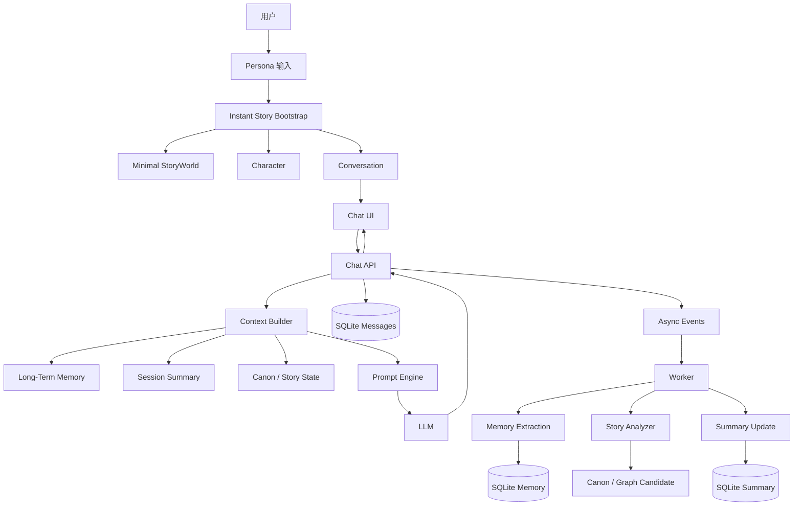

# GameStart「即时故事 + Chat + Prompt Engine + Long-Term Memory」改造计划

> 状态：规划稿  
> 适用阶段：快速开发 / 功能闭环优先期  
> 目标仓库：`lark-x/GameStart`  
> 核心目标：让用户只填写一个人设，就能立即开始故事；聊天成为一级产品入口，Prompt Engine 与长期 Memory 成为 AI 运行核心。

---

# 1. 背景与问题定义

当前 GameStart V2 已经具备较完整的结构化创作能力，包括：

- StoryWorld
- Canon
- Character
- Location
- Fact / Rule / Timeline
- Narrative Graph
- Typed State
- Scene Generation
- Candidate Review
- Asset Generation
- Release / Runtime
- SQLite 持久化
- Redis / Worker 异步任务
- 模型配置与调用日志

这些能力本身有价值，但当前用户主链路偏向“创作者工具”：

```text
创建 World
→ 填写世界设定
→ 建立角色
→ 建立地点 / Fact / Rule
→ Narrative Graph
→ Typed State
→ Generation
→ Candidate Review
→ Release
→ Runtime
```

对于希望快速开始故事的用户，这条链路过长。

新的目标不是删除现有结构，而是改变产品入口：

```text
用户只填写一个人设
→ 开始故事
→ 立即进入 Chat
→ AI 开场
→ 用户通过聊天推进故事
→ 后台逐渐产生 Memory / Canon / Story Structure
```

即：

> 从“先配置世界，再开始故事”，改成“先开始故事，世界在使用过程中生长”。

---

# 2. 改造目标

## 2.1 用户侧目标

从空数据库到 AI 开始说第一句话，用户只需要：

1. 填写一个人设
2. 点击一次“开始故事”

不要求用户先填写：

- 故事名称
- 世界观
- 地点
- 时间线
- Narrative Graph
- Typed State
- Prompt
- Token Budget
- Release 配置

最终首屏体验：

```text
┌─────────────────────────────────────┐
│           创建新的故事              │
│                                     │
│  描述你想遇到的角色                 │
│                                     │
│  ┌───────────────────────────────┐  │
│  │ 花火是一个……                  │  │
│  │ 性格……                        │  │
│  │ 说话方式……                    │  │
│  │ 与我的关系……                  │  │
│  └───────────────────────────────┘  │
│                                     │
│             [ 开始故事 ]            │
└─────────────────────────────────────┘
```

点击后直接进入：

```text
Persona
→ Instant Story Bootstrap
→ Conversation
→ Prompt Engine
→ LLM
→ AI Opening
→ Chat
```

---

# 3. 产品定位调整

## 3.1 新的一级产品入口

新增一级能力：

```text
Instant Story
即时故事
```

即时故事由以下系统组成：

```text
Instant Story
├─ Persona
├─ Chat
├─ Prompt Engine
├─ Long-Term Memory
├─ Session Summary
├─ Image Attachment
└─ Background Story Structuring
```

现有结构化创作能力保留，转为高级能力：

```text
Advanced Authoring
├─ Canon
├─ Narrative Graph
├─ Typed State
├─ Candidate Review
├─ Asset Library
└─ Release
```

---

# 4. 新的总体架构



---

# 5. 核心设计原则

## 5.1 用户同步链路必须短

用户发送一条消息时，只经过：

```text
User Message
→ Save Message
→ Retrieve Context
→ Prompt Engine
→ LLM
→ Stream Reply
→ Save Reply
```

不得在同步聊天链路加入：

- Candidate Review
- Narrative Graph
- Release
- Redis Worker
- Canon 自动写入
- Memory Extraction
- Story Analyze
- Asset Review

这些全部放到后台。

---

## 5.2 结构化能力按需生成

禁止：

```text
Persona
→ 生成完整 World
→ 生成 Characters
→ 生成 Locations
→ 生成 Facts
→ 生成 Rules
→ 生成 Graph
→ 生成 State
→ 生成 Scene
→ 才能聊天
```

正确方式：

```text
Persona
→ Minimal World
→ Character
→ Conversation
→ Chat
```

其余数据采用：

> Lazy Generation / Lazy Structuring

只有当故事真实产生相关内容后再结构化。

---

## 5.3 Chat 与 Authoring 解耦

Chat 是实时产品路径。

Authoring 是结构化编辑与审核路径。

两者共享：

- StoryWorld
- Character
- Canon
- Memory
- Asset
- Prompt Engine

但不互相阻塞。

---

# 6. Phase 1：Instant Story Bootstrap

## 6.1 新增 Use Case

建议新增：

```text
CreateInstantStory
```

职责：

- 根据 Persona 创建最小 StoryWorld
- 创建主 AI Character
- 创建 Conversation
- 返回可以直接进入聊天页的结果

---

## 6.2 API

新增：

```http
POST /api/v2/instant-stories
```

请求：

```ts
interface V2CreateInstantStoryRequest {
  persona: string;
  idempotencyKey: V2IdempotencyKey;
}
```

可选：

```ts
interface V2CreateInstantStoryRequest {
  persona: string;
  displayName?: string;
  idempotencyKey: V2IdempotencyKey;
}
```

但默认 UI 只展示 Persona。

响应：

```ts
interface V2CreateInstantStoryResponse {
  storyWorld: V2StoryWorldDto;
  character: V2CharacterDto;
  conversation: V2ConversationDto;
}
```

---

## 6.3 Bootstrap 事务

一次 SQLite Transaction：

```text
BEGIN

Create StoryWorld
Create Character
Create Conversation

COMMIT
```

任何一步失败：

```text
ROLLBACK
```

保证不会产生：

- World 存在但 Character 不存在
- Character 存在但 Conversation 不存在

---

# 7. Persona 模型

## 7.1 Persona 必须保留原始文本

Character 增加：

```ts
interface V2CharacterDto {
  characterId: V2CharacterId;
  storyWorldId: V2StoryWorldId;

  name: string;
  summary?: string;

  personaText?: string;

  homeLocationId?: V2LocationId;

  createdAt: string;
}
```

Persona 的事实源是：

```text
personaText
```

不要在创建阶段强制拆成：

```json
{
  "personality": [],
  "speechStyle": [],
  "likes": [],
  "dislikes": []
}
```

因为：

- 用户原始文本信息最完整
- 结构化解析可能丢失细节
- Prompt 可以直接使用原文
- 后期可以异步生成结构化 Profile

---

## 7.2 Persona 后台分析

后续可选新增：

```text
Persona Analyzer
```

生成派生信息：

```ts
interface V2PersonaProfile {
  traits: string[];
  speechStyle: string[];
  likes: string[];
  dislikes: string[];
  relationshipHints: string[];
}
```

但：

```text
personaText = Source of Truth
personaProfile = Derived Data
```

---

# 8. Phase 2：V2 Chat Domain

建议在 V2 内新增 Chat 边界：

```text
packages/contracts/src/v2/chat/
packages/domain/src/v2/chat/
packages/ports/src/v2/chat/
packages/database/src/v2/chat/
apps/api/src/v2/chat/
apps/web/src/v2/chat/
```

不建议当前阶段再拆新的 workspace package。

---

# 9. Conversation 模型

第一版只支持：

```text
User ↔ AI Character
```

暂不支持群聊。

建议：

```ts
interface V2Conversation {
  conversationId: V2ConversationId;

  storyWorldId: V2StoryWorldId;
  primaryCharacterId: V2CharacterId;

  title?: string;

  createdAt: V2IsoDateTime;
  updatedAt: V2IsoDateTime;
  lastMessageAt?: V2IsoDateTime;
}
```

以后扩展多人时再增加 Member 模型。

---

# 10. Message 模型

```ts
type V2ChatRole =
  | "user"
  | "assistant"
  | "system";

type V2ChatMessageStatus =
  | "pending"
  | "completed"
  | "failed"
  | "interrupted";

interface V2ChatMessage {
  messageId: V2MessageId;

  conversationId: V2ConversationId;

  role: V2ChatRole;

  characterId?: V2CharacterId;

  text?: string;

  attachments: readonly V2MessageAttachment[];

  status: V2ChatMessageStatus;

  createdAt: V2IsoDateTime;

  idempotencyKey: V2IdempotencyKey;

  replyToMessageId?: V2MessageId;
}
```

---

# 11. Chat API

第一版建议：

```http
GET /api/v2/chat/conversations
GET /api/v2/chat/conversations/:id
GET /api/v2/chat/conversations/:id/messages

POST /api/v2/chat/conversations/:id/messages
POST /api/v2/chat/conversations/:id/replies

POST /api/v2/chat/media
```

---

## 11.1 POST messages

职责：

```text
验证 Conversation
验证用户
验证 Attachment
保存 User Message
返回 Message
```

不直接调用 LLM。

---

## 11.2 POST replies

职责：

```text
Load Conversation
→ Load Context
→ Prompt Engine
→ LLM Streaming
→ Save Assistant Message
```

---

# 12. Chat 不经过 Worker

实时 Chat：

```text
Web
→ API
→ Prompt Engine
→ LLM
→ Streaming
→ Web
```

不要：

```text
Web
→ API
→ SQLite
→ Redis
→ Worker
→ LLM
→ Redis
→ API
→ Web
```

原因：

- 延迟更高
- 故障点更多
- Streaming 更复杂
- 调试更困难

Worker 继续负责：

- Memory Extraction
- Memory Consolidation
- Story Analyze
- Session Summary
- Asset Generation
- Scene Generation

---

# 13. Streaming Chat

Streaming 属于 P0。

必须支持：

```text
发送
→ loading
→ token stream
→ complete
```

同时支持：

- Stop Generation
- Retry
- Interrupted
- Provider Error
- Model Not Configured

推荐协议：

```text
SSE
```

第一版不需要 WebSocket。

---

# 14. Chat UI

建议新路由：

```text
/v2/chat/:conversationId
```

页面结构：

```text
┌─────────────────────────────────────┐
│  ←    花火                        ⋯ │
├─────────────────────────────────────┤
│                                     │
│  花火                               │
│  你终于来了。                       │
│                                     │
│                         用户         │
│                   今天上海下雨了     │
│                   [image.jpg]       │
│                                     │
│  花火                               │
│  原来你那里也在下雨……              │
│                                     │
├─────────────────────────────────────┤
│  ＋  输入消息……              [发送] │
└─────────────────────────────────────┘
```

---

## 14.1 P0 Chat 功能

| 功能 | 优先级 |
|---|---|
| 消息历史 | P0 |
| 文本消息 | P0 |
| AI Streaming | P0 |
| 发送图片 | P0 |
| 图片预览 | P0 |
| 自动滚动 | P0 |
| Stop Generation | P0 |
| Retry | P0 |
| 页面刷新恢复 | P0 |
| Provider 错误 | P0 |
| Model 未配置提示 | P0 |
| Regenerate | P1 |
| Edit & Resend | P1 |
| Delete Message | P1 |
| 搜索 | P2 |
| 群聊 | P3 |

---

# 15. Phase 3：Prompt Engine

Prompt Engine 是新 AI 系统核心。

不要继续由各个 Use Case 自己拼 Prompt。

---

# 16. Prompt Engine 职责

输入：

```ts
interface PromptContext {
  task: PromptTask;

  persona?: PersonaContext;

  world?: WorldContext;

  canon?: readonly CanonContextItem[];

  memories: readonly MemoryContext[];

  sessionSummary?: string;

  recentMessages: readonly ChatMessage[];

  currentInput?: ChatInput;

  tokenBudget: number;
}
```

输出：

```ts
interface PreparedPrompt {
  templateId: string;

  templateVersion: string;

  messages: readonly ChatMessage[];

  estimatedTokens: number;

  contextHash: string;

  sources: readonly PromptSource[];
}
```

Prompt Engine 不负责：

- 查数据库
- 保存消息
- 调 LLM
- 写 Memory
- 写 Canon

只负责：

```text
Context
→ Selection
→ Budget
→ Prompt Assembly
```

---

# 17. Prompt Template Registry

建议：

```text
packages/ai/src/prompt-engine/
├─ index.ts
├─ registry.ts
├─ context.ts
├─ budget.ts
├─ hash.ts
├─ templates/
│  ├─ story-bootstrap-v1.ts
│  ├─ chat-reply-v1.ts
│  ├─ memory-extract-v1.ts
│  ├─ memory-consolidate-v1.ts
│  └─ scene-generate-v2.ts
└─ tests/
```

---

# 18. 第一批 Prompt Tasks

```ts
type PromptTask =
  | "story.bootstrap"
  | "chat.reply"
  | "memory.extract"
  | "memory.consolidate"
  | "scene.generate";
```

以后扩展：

```text
story.title
story.summary
image.prompt
canon.extract
relationship.update
```

---

# 19. Prompt 优先级

## Level 0：绝不能丢

```text
Platform Rules
Persona
Current User Input
```

## Level 1：高优先级

```text
Recent Messages
Current Story State
Relevant Canon
```

## Level 2：动态检索

```text
Long-Term Memory
Historical Events
Relevant Character Information
```

## Level 3：低优先级

```text
Old Messages
Low Relevance Memory
Background Detail
```

超预算时：

```text
Trim Level 3
→ Compress Level 2
→ Compress Old Recent Messages
```

不能删除：

```text
Persona
Current Input
Critical Rules
```

---

# 20. chat.reply Prompt 结构

```text
SYSTEM

[Platform Rules]

[Character Identity]
你正在扮演：花火

[Persona]
<personaText>

[Current Story State]
...

[Relevant Long-Term Memory]
- ...
- ...

[Conversation Summary]
...

RECENT MESSAGES

User:
...

Assistant:
...

CURRENT TURN

User:
...
```

---

# 21. Prompt Engine Debug

每次 AI 调用建议保存：

```text
task
templateId
templateVersion

contextHash

estimatedTokens
actualInputTokens
outputTokens

personaIncluded

canonCount
memoryCount
recentMessageCount
imageCount

provider
model

latency

selectedMemoryIds
selectedCanonIds
```

模型日志 UI 可以展示：

```text
Prompt Task: chat.reply
Template: chat.reply.v2
Memory: 8
Recent Messages: 24
Images: 1
Input Tokens: 7214
Output Tokens: 642
Latency: 3.8s
```

Secret 不得进入日志。

---

# 22. Phase 4：聊天图片

聊天图片与正式 Asset Library 必须分离。

正式素材：

```text
Asset
→ Candidate
→ Review
→ Approved Asset
```

聊天附件：

```text
Chat Attachment
```

不进入 Asset Review。

---

# 23. Chat Media 数据模型

```ts
interface V2ChatMedia {
  mediaId: V2MediaId;

  contentHash: string;

  mediaRef: string;

  mimeType: string;

  byteSize: number;

  width?: number;
  height?: number;

  createdAt: V2IsoDateTime;
}
```

建议媒体命名空间：

```text
media://local/v2/chat/<hash>.<ext>
```

不要与：

```text
media://local/v2/assets/
```

混用。

---

# 24. 上传流程

```text
Select Image
→ Web Preview
→ POST /api/v2/chat/media
→ MIME Check
→ Size Check
→ Hash
→ Save Local File
→ Save Metadata
→ mediaId
→ Send Message
```

不要把 Base64 存入 SQLite。

---

# 25. Attachment

```ts
interface V2MessageAttachment {
  attachmentId: string;

  kind: "image";

  mediaId: V2MediaId;

  mediaRef: string;

  mimeType: string;

  width?: number;
  height?: number;
}
```

一条消息允许：

```text
text only
image only
text + image
```

---

# 26. Vision 模型支持

Model Profile 增加：

```ts
interface ModelCapabilities {
  inputModalities: readonly (
    | "text"
    | "image"
  )[];
}
```

不要通过模型名称猜是否支持图片。

如果支持：

```text
Image
→ LLM Vision Input
```

如果不支持：

```text
Message 仍然保存
→ UI 给提示
→ Prompt 使用 Text Fallback
```

不能导致整个聊天失败。

---

# 27. Phase 5：Long-Term Memory

Memory 是 Chat 长期体验核心。

目标：

```text
Conversation
→ Extract Important Information
→ Store Memory
→ Retrieve Relevant Memory
→ Prompt Engine
```

不是：

```text
把全部历史消息塞给 LLM
```

---

# 28. Memory 类型

第一版：

```ts
type V2MemoryKind =
  | "profile"
  | "preference"
  | "relationship"
  | "episodic"
  | "world_fact";
```

Session Summary 独立于 Memory。

---

# 29. Memory 模型

```ts
interface V2Memory {
  memoryId: V2MemoryId;

  storyWorldId: V2StoryWorldId;

  conversationId?: V2ConversationId;

  characterId?: V2CharacterId;

  kind: V2MemoryKind;

  content: string;

  importance: number;

  confidence: number;

  sourceMessageIds: readonly V2MessageId[];

  status:
    | "active"
    | "superseded"
    | "forgotten";

  supersedesMemoryId?: V2MemoryId;

  createdAt: V2IsoDateTime;

  updatedAt: V2IsoDateTime;

  lastAccessedAt?: V2IsoDateTime;
}
```

---

# 30. Memory 示例

输入：

```text
我特别讨厌香菜。
```

提取：

```json
{
  "kind": "preference",
  "content": "用户不喜欢香菜",
  "importance": 0.65,
  "confidence": 0.98
}
```

输入：

```text
我小时候一直住在南康。
```

提取：

```json
{
  "kind": "profile",
  "content": "用户童年曾生活在南康",
  "importance": 0.72,
  "confidence": 0.92
}
```

---

# 31. Memory Extraction

不要阻塞聊天。

流程：

```text
Assistant Reply Saved
→ enqueue Memory Extraction
→ Worker
→ Prompt Engine: memory.extract
→ LLM Structured Output
→ Domain Validate
→ Deduplicate
→ Save Memory
```

---

# 32. Extraction 频率

不建议每一轮都调用 Memory LLM。

第一版：

```text
每 4 个 User Turn
```

执行一次。

也可以在满足以下条件时提前触发：

```text
Potential Profile Fact
Potential Preference
Potential Relationship Change
Important Event
```

后续再增加规则检测。

---

# 33. Memory Retrieval

第一版只使用：

```text
SQLite + FTS5
```

不要强制引入 Qdrant。

排序可以：

```text
score =
  lexical_relevance
  + importance
  + confidence
  + recency
```

示例：

```text
Score =
  FTS × 0.50
  + importance × 0.20
  + confidence × 0.15
  + recency × 0.15
```

具体权重可以后期调整。

---

# 34. Retrieval 流程

```text
Current User Input
→ Search Memory
→ Filter active
→ Filter visibility
→ Rank
→ Top K
→ Prompt Engine
```

第一版：

```text
Top K = 5～10
```

---

# 35. Memory 去重

提取新 Memory 后：

```text
Search Similar Existing Memory
```

情况 1：

```text
完全重复
→ Ignore
```

情况 2：

```text
相同事实但表达更完整
→ Update
```

情况 3：

```text
发生变化
→ Supersede
```

---

# 36. Memory 纠正

原 Memory：

```text
用户喜欢咖啡
```

后来：

```text
我最近完全不喝咖啡了。
```

新 Memory：

```text
用户目前基本不喝咖啡
```

旧 Memory：

```text
status = superseded
```

新 Memory：

```text
supersedesMemoryId = old
```

Prompt Engine 只读取：

```text
active
```

Memory。

---

# 37. Memory Consolidation

长期使用后：

```text
用户喜欢咖啡
用户喜欢拿铁
用户最近常买咖啡豆
用户每天早上喝咖啡
```

后台可以：

```text
memory.consolidate
```

合并成：

```text
用户长期有饮用咖啡的习惯，偏好拿铁，也会购买咖啡豆。
```

旧记录标记：

```text
superseded
```

不立即物理删除。

---

# 38. Memory 与 Canon 的边界

必须明确：

```text
Canon = 世界正式事实
Memory = 角色 / 系统所记得的信息
```

Memory 可以：

- 主观
- 不完整
- 低置信度
- 过时
- 被纠正

Canon 不应该如此。

Memory 绝对不能直接覆盖 Canon。

---

# 39. Session Summary

聊天历史不能无限进入 Prompt。

推荐：

```text
Recent Messages
+
Session Summary
+
Relevant Memory
```

而不是：

```text
All Messages
```

---

# 40. Summary 模型

```ts
interface V2ConversationSummary {
  conversationId: V2ConversationId;

  summary: string;

  coveredUntilMessageId: V2MessageId;

  sourceMessageCount: number;

  updatedAt: V2IsoDateTime;

  version: number;
}
```

---

# 41. Summary 更新策略

例如：

```text
当未摘要消息 >= 30
```

后台生成新 Summary。

流程：

```text
Existing Summary
+
Next 30 Messages
→ Prompt Engine: conversation.summary
→ New Summary
```

Prompt Engine 使用：

```text
Summary
+
Recent 20～40 Messages
```

---

# 42. Context Budget

需要统一 Token Budget。

例如：

```text
Persona           15%
Canon             15%
Memory            20%
Summary           15%
Recent Messages   30%
Current Input      5%
```

这里只是初始建议，不应硬编码成死比例。

核心原则：

```text
Persona 永远保留
Current Input 永远保留
Recent Messages 高优先
Memory 动态选择
Old History 用 Summary
```

---

# 43. Phase 6：Chat → Structured Story

Chat 稳定后再接结构化。

后台新增：

```text
Story Analyzer
```

输入：

```text
Messages
Memory
Current Canon
```

输出：

```text
Character Fact Candidate
World Fact Candidate
Timeline Candidate
Relationship Candidate
Graph Candidate
```

这些全部进入 Candidate。

不得直接写 Canon。

---

# 44. 结构化 Story 的 UX

聊天页面或工作区可以提示：

```text
发现 4 条新的故事事实

[查看]
```

进入：

```text
Candidate Review
```

用户可：

```text
Approve
Reject
Ignore
Edit
```

只有 Approve 才进入 Canon。

---

# 45. Narrative Graph 的新定位

Graph 不再是开始聊天的前置条件。

新的关系：

```text
Chat
→ Story Happens
→ Story Analyzer
→ Graph Candidate
→ Structured Graph
```

以后仍然可以支持高级创作者：

```text
Graph
→ Guide Future Story
```

但 Instant Story 不依赖它。

---

# 46. Background Worker 职责

新的 Worker 职责：

```text
Worker
├─ Memory Extraction
├─ Memory Consolidation
├─ Conversation Summary
├─ Story Analyzer
├─ Canon Candidate Extraction
├─ Scene Generation
└─ Asset Generation
```

Chat LLM 不进入 Worker。

---

# 47. 数据库建议

新增 V2 表：

```text
v2_conversations
v2_chat_messages
v2_chat_media
v2_memories
v2_conversation_summaries
```

可能增加：

```text
v2_memory_extraction_jobs
v2_story_analysis_jobs
```

但如果已有统一 Job Infrastructure，可复用，不要为了每一种任务建一套 Job 表。

---

# 48. Migration 原则

Migration 只新增。

当前快速开发阶段仍应保证：

```text
旧 SQLite
→ up migration
→ 新版本
```

测试至少覆盖：

```text
Fresh DB
Existing DB
Migration Re-run Safety
```

不要把 Chat 数据塞进现有不相关表。

---

# 49. 新路由建议

```text
/v2
/v2/start
/v2/chat/:conversationId

/v2/workspace/*
/v2/settings/*
```

默认入口可以逐渐改成：

```text
/v2/start
```

已有故事时：

```text
/v2
→ 最近 Conversation
```

或首页展示：

```text
继续故事
新建故事
高级创作
```

---

# 50. 首页建议

```text
┌──────────────────────────────┐
│          GameStart           │
│                              │
│  继续故事                    │
│  ┌────────────────────────┐  │
│  │ 花火 · 2 分钟前        │  │
│  └────────────────────────┘  │
│                              │
│        [ 创建新故事 ]         │
│                              │
│        高级创作工作区          │
└──────────────────────────────┘
```

---

# 51. 开发阶段安排

## Phase 1：Persona → Chat

实现：

- Persona
- Instant Story Bootstrap
- Conversation
- Message
- SQLite
- 基础 Chat UI

验收：

```text
空数据库
→ 填 Persona
→ 开始故事
→ 进入 Chat
→ 刷新
→ World / Character / Conversation 仍存在
```

---

## Phase 2：Prompt Engine + Streaming Text Chat

实现：

- PromptContext
- Template Registry
- Budget Manager
- Context Hash
- chat.reply
- story.bootstrap
- SSE Streaming
- Stop
- Retry

验收：

```text
Persona
→ AI Opening
→ 连续聊天 20 Turn
→ Persona 不明显漂移
→ 刷新历史仍存在
```

---

## Phase 3：Image Chat

实现：

- Chat Media
- Upload
- Preview
- Attachment
- Vision Input
- Capability Detection
- Text Fallback

验收：

```text
选择图片
→ Preview
→ Send
→ LLM Vision
→ Reply
→ Refresh
→ Image Still Available
```

---

## Phase 4：Long-Term Memory V1

实现：

- Memory Table
- Memory Domain
- Memory Port
- Memory Repository
- FTS5 Retrieval
- memory.extract
- Worker Extraction
- Prompt Integration

验收：

第一轮：

```text
我的生日是 3 月 12 日。
```

关闭应用，重新打开。

下一次：

```text
你还记得我的生日吗？
```

能够检索并自然使用相关 Memory。

---

## Phase 5：Summary + Consolidation

实现：

- Session Summary
- Prompt Compression
- Memory Dedup
- Supersede
- Consolidation

验收：

模拟：

```text
200～500 Turn
```

Prompt 长度不随总消息数线性增长。

---

## Phase 6：Chat → Structured Story

实现：

- Story Analyzer
- Canon Candidate
- Timeline Candidate
- Graph Candidate
- Review UI

验收：

```text
Chat 发生一个明确故事事件
→ 后台检测
→ 生成 Candidate
→ Approve
→ Canon
```

---

# 52. PR 拆分

按用户结果拆。

## PR1

```text
feat: start persistent story from persona
```

完成：

```text
Persona
→ StoryWorld
→ Character
→ Conversation
→ Chat UI
```

---

## PR2

```text
feat: add prompt engine and streaming chat
```

完成：

```text
Prompt Engine
→ LLM
→ SSE
→ Stop / Retry
```

---

## PR3

```text
feat: support multimodal chat attachments
```

完成：

```text
Image Upload
→ Attachment
→ Vision
→ Fallback
```

---

## PR4

```text
feat: add long-term conversational memory
```

完成：

```text
Memory Extraction
→ SQLite/FTS
→ Retrieval
→ Prompt
```

---

## PR5

```text
feat: derive structured story candidates from chat
```

完成：

```text
Chat
→ Story Analyzer
→ Candidate
→ Canon
```

---

# 53. 测试策略

保持快速开发原则。

## P0 Domain Tests

覆盖：

- Persona validation
- Conversation
- Message
- Attachment
- Memory
- Supersede
- Memory visibility
- Prompt budget
- Prompt deterministic hash

---

## API Tests

覆盖：

```text
Create Instant Story
Send Message
Read Messages
Retry Idempotency
Upload Media
Generate Reply
Memory Retrieval
```

---

## Integration Tests

优先一个真实 SQLite 链路：

```text
Persona
→ Bootstrap
→ Message
→ Reply
→ Memory
→ Restart
→ Read
```

比每层堆大量 Mock 更有价值。

---

## E2E

关键路径：

```text
Open
→ Persona
→ Start
→ Chat
→ Image
→ Refresh
```

E2E 不需要覆盖所有内部边界。

---

# 54. 性能指标

建议定义最初目标。

## First Story

```text
Persona Submit
→ Chat Page
```

本地操作目标：

```text
< 500ms
```

不包括模型首次响应。

---

## Chat

用户发送：

```text
Send
→ First Token
```

主要由 Provider 决定。

系统额外开销应尽量：

```text
< 300ms
```

不包括模型等待。

---

## Memory Search

SQLite FTS：

```text
< 50ms
```

正常个人规模下应足够。

---

# 55. 可观测性

每个 Chat Request 建议记录：

```text
traceId
conversationId
messageId
task

promptTemplate
promptVersion

memoryCount
recentMessageCount
canonCount

provider
model

firstTokenLatency
totalLatency

inputTokens
outputTokens

status
errorCode
```

---

# 56. 错误处理

Chat 页面明确区分：

```text
MODEL_NOT_CONFIGURED
PROVIDER_TIMEOUT
PROVIDER_RATE_LIMIT
INVALID_PROVIDER_RESPONSE
MEDIA_TOO_LARGE
UNSUPPORTED_MEDIA
VISION_NOT_SUPPORTED
CONVERSATION_NOT_FOUND
MESSAGE_CONFLICT
```

不要所有错误只显示：

```text
生成失败
```

---

# 57. Idempotency

以下全部保留 Idempotency：

```text
Create Instant Story
Send Message
Generate Reply
Upload Media Metadata
Memory Extraction Job
Story Analysis Job
```

避免网络重试生成：

- 重复 Conversation
- 重复 Message
- 重复 AI Reply
- 重复 Memory

---

# 58. 安全边界

保持现有原则：

- API Key 不返回前端
- Secret 不进入 Prompt Log
- Chat Media 校验 MIME
- 限制文件大小
- 内容 Hash
- 禁止路径穿越
- LLM 输出是不可信输入
- Memory Extraction 输出必须 Parser Validate
- Story Analyzer 输出不能直接写 Canon

---

# 59. 第一版明确不做

为了避免再次过度设计，暂缓：

- 群聊
- 多 AI 同场聊天
- Voice Chat
- 视频
- Qdrant 强依赖
- Agent Tool Calling
- Prompt DSL
- Prompt Marketplace
- Memory Graph
- 全自动 Canon 写入
- 全自动 Graph 维护
- 多用户实时协作
- 云同步

---

# 60. 成功标准

## 成功标准 A：零配置开始故事

```text
空数据库
→ 一个 Persona
→ 一次点击
→ AI 开始故事
```

---

## 成功标准 B：Chat 是独立闭环

聊天不依赖：

```text
Graph
State
Release
Candidate Review
Redis
```

---

## 成功标准 C：长期上下文稳定

从：

```text
20 Turn
```

增长到：

```text
500 Turn
```

Prompt 仍然主要由：

```text
Persona
+ Summary
+ Relevant Memory
+ Recent Messages
+ Current Input
```

组成。

---

## 成功标准 D：Memory 可解释

能够回答：

```text
为什么 AI 记得这件事？
```

系统可以指出：

```text
Memory ID
Source Messages
Confidence
CreatedAt
LastAccessedAt
```

---

## 成功标准 E：Prompt 可调试

能够回答：

```text
为什么 AI 这一次回复异常？
```

至少可查看：

- Prompt Template
- Prompt Version
- Memory Selection
- Context Size
- Model
- Token Usage
- Latency

---

# 61. 最终推荐的核心架构

```text
Web
 │
 ▼
API
 │
 ├─────────────────────────────┐
 │                             │
 ▼                             ▼
Chat Use Cases             Authoring Use Cases
 │                             │
 ▼                             ▼
Conversation                  Canon
Message                       Graph
Attachment                    State
 │                             │
 ├─────────────┐               │
 │             │               │
 ▼             ▼               │
Memory     Context Builder ◄────┘
 │             │
 │             ▼
 │        Prompt Engine
 │             │
 │             ▼
 │            LLM
 │             │
 │             ▼
 │          Response
 │
 ▼
SQLite
```

Worker：

```text
Memory Extraction
Memory Consolidation
Conversation Summary
Story Analyze
Scene Generation
Asset Generation
```

Redis：

```text
只承担异步任务
```

---

# 62. 推荐执行优先级

按价值排序：

```text
P0
Persona → Instant Story → Chat

P0
Prompt Engine → Streaming Reply

P0
Image Chat

P1
Long-Term Memory

P1
Session Summary

P1
Memory Consolidation

P2
Chat → Canon Candidate

P2
Chat → Narrative Graph

P3
更多自动化与高级创作能力
```

---

# 63. 推荐近期开发目标

第一阶段只要求真正完成：

```text
Persona
→ Persistent Conversation
→ Prompt Engine
→ Streaming Text Chat
```

这个闭环一旦稳定，GameStart 就有了一个真正可持续扩展的产品核心。

第二阶段再接：

```text
Image
→ Long-Term Memory
```

第三阶段：

```text
Chat
→ Structured Story
```

不要把全部能力一次性塞进第一个 PR。

---

# 64. 最终产品方向

整改后的 GameStart 应逐渐从：

> 一个要求用户先建立世界、角色、图、状态，然后再生成内容的 AI 创作工具

转变成：

> 一个让用户先遇到一个角色、立刻开始聊天和经历故事，并在长期互动过程中自动形成记忆、世界设定和故事结构的 AI Story System。

最终核心体验是：

```text
输入一个人设
→ 开始一个故事
→ 和角色长期互动
→ 世界自然生长
→ 系统自动记住重要事情
→ 后台逐渐结构化
→ 用户需要时再进入高级创作
```

这应作为 GameStart 下一阶段最主要的产品与架构方向。
