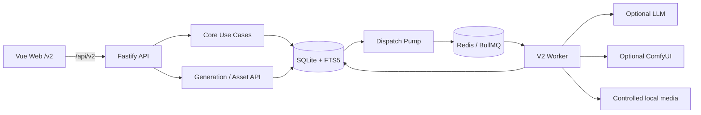

# Living Network

[](https://github.com/lark-x/GameStart/actions/workflows/ci.yml)

Living Network V2 是一个本地优先的 AI 互动游戏创作、审核、发布和游玩平台。

创作者维护世界 Canon、叙事图和类型化状态；AI 负责生成可追踪的场景或资产候选；只有经过审核的内容才能进入 Canon 和不可变 Release；玩家基于固定 Release 游玩、保存、恢复和导出。

## 当前状态

V2 的 Core、Generation/Assets、Worker 和 Web 已完成集成，并成为默认的开发、Compose、CI 和验收路径。

当前默认技术边界：

- Vue 3 + Vite Web，默认入口 `/v2`
- Fastify API，公共 API 前缀 `/api/v2`
- Node.js 24 内置 `node:sqlite` + FTS5，SQLite 是唯一业务事实来源
- 独立 Worker + BullMQ/Redis，Redis 只保存可重建的队列和派发状态
- 本地内容哈希媒体存储，通过 API 受控访问
- LLM、ComfyUI 和 Qdrant 为可选能力，默认关闭或未验收

V1 的 PostgreSQL、旧 API、旧 Worker 和旧 Web 功能已经冻结，不参与当前默认运行时、CI 或 Compose。V1 数据和历史 migration 没有在本次切换中删除，归档分支为 `archive/v1-final`。

## 核心功能

当前产品闭环如下：

```text
World Canon
  → Narrative Graph
  → Typed State
  → AI Candidate
  → Review
  → Immutable Release
  → Player Runtime / Save / Export
```

| 模块 | 当前能力 |
| --- | --- |
| Canon | 世界、角色、地点、事实、规则、时间线、修订号和幂等写入 |
| Narrative Graph | Arc、Scene、Choice、入口场景、可达性和引用诊断 |
| Typed State | 类型化变量、初始状态、状态差异预览、gate/consequence 校验 |
| Candidate Review | 场景/资产候选、approve、reject、request changes、审核审计和原子应用 |
| Generation | 上下文快照、来源追踪、场景 Job、有限重试和候选提交 |
| Assets | ComfyUI 适配器、内容哈希媒体、资产候选和批准资产库 |
| Release | preflight、不可变 manifest、content hash、JSON/Markdown 导出 |
| Player | Release 绑定运行、选择、条件、Save/Restore 和版本校验 |
| Worker | SQLite outbox、BullMQ 派发、租约恢复、幂等消费和错误终态 |
| Web | Canon、Graph、Review、Assets、Release、Player 和 Operations 工作区 |

## 系统如何运转



关键边界：

- API 负责 Route → Parser → Use Case → Port → Adapter，并负责 SQLite up migration。
- Worker 等待 API readiness，不执行 migration。
- 外部模型和 ComfyUI 的输出是不可信输入，必须经过解析、领域校验和候选审核。
- Player Runtime 只读取不可变 Release，不读取工作区中的 pending candidate。
- Redis、Qdrant 和媒体索引都应能从 SQLite 事实重建，不能成为唯一事实来源。

## 快速开始

### 环境要求

- Node.js 24 或更高版本
- pnpm 11.1.2
- Docker Compose（仅持久化本地栈需要）

```sh
corepack enable
corepack prepare pnpm@11.1.2 --activate
pnpm install --frozen-lockfile
```

### 离线核心开发

核心编辑、发布和已发布游玩不需要 Redis、LLM 或 ComfyUI。

终端一：

```sh
pnpm --filter @living-network/api dev:v2
```

终端二：

```sh
pnpm --filter @living-network/web dev
```

打开 <http://127.0.0.1:4173/v2>。

| 服务 | 地址 |
| --- | --- |
| Web | `http://127.0.0.1:4173/v2` |
| API | `http://127.0.0.1:3002` |
| Health | `GET /api/v2/health` |
| Ready | `GET /api/v2/ready` |
| Capabilities | `GET /api/v2/capabilities` |

首次访问空 SQLite 工作区时，Web 会显示创建 Starter World 的入口。主机进程默认使用代码中的 V2 默认配置；`.env` 主要供 Compose 使用，不会被 Node 进程自动加载。需要自定义环境变量时，请在启动进程前显式导出它们。

### 启动 V2 Worker

Worker 用于派发和处理生成任务。启用场景或资产生成时，需要 Redis 以及对应的 LLM/ComfyUI 配置。

```sh
pnpm --filter @living-network/worker start:v2
```

Worker 使用同一个 `V2_SQLITE_PATH`，会先确认 SQLite schema 已由 API 完成迁移；任务具有稳定幂等键、有限重试、租约恢复和明确终态。

### Compose 持久化栈

```sh
cp .env.example .env
docker compose --env-file .env -f infra/compose/docker-compose.yml up -d
docker compose --env-file .env -f infra/compose/docker-compose.yml ps
```

Compose 包含四个服务：`redis`、`api`、`worker`、`web`。SQLite、Redis 和媒体分别使用持久化卷。访问 <http://127.0.0.1:4173>，API 暴露在 <http://127.0.0.1:3002>。

停止服务但保留数据：

```sh
docker compose --env-file .env -f infra/compose/docker-compose.yml down
```

`down -v` 会删除 V2 SQLite、Redis 和媒体卷，使用前必须确认备份。V1 数据删除不属于本项目当前切换流程。

## 可选能力

默认情况下，外部生成能力关闭，Core 编辑、发布和已发布游玩仍可用。

场景生成需要 `V2_SCENE_GENERATION_ENABLED=true`，然后在 Web 的“平台配置 → 模型与能力”中保存模型档案并绑定“场景生成”。也可以用完整的 `LLM_BASE_URL`、`LLM_MODEL`（Anthropic 还需要 `LLM_API_KEY`）作为环境变量兜底。资产生成需要 `V2_ASSET_GENERATION_ENABLED=true`，然后在“平台配置 → 图片服务”中填写 ComfyUI 地址，或使用 `COMFYUI_BASE_URL` 环境变量兜底。保存 API 密钥前需要设置 `INTEGRATION_SECRET_KEY`。

Web 的“诊断与自动化 → 模型调用日志”会展示脱敏后的请求、响应、耗时、Token 用量和错误上下文；日志默认保留 30 天。当前 Web 为中文单语言界面，暂不提供语言切换功能。

```sh
VITE_V2_ENABLE_MOCK=true pnpm --filter @living-network/web dev
```

上面的命令只用于 UI 开发。真实 LLM、ComfyUI 和 Qdrant 不会因为 Fake、内存或 SQLite 测试通过而自动被视为已验收。

## 验证与质量门槛

常用验证：

```sh
pnpm check:boundaries
pnpm typecheck
pnpm test
pnpm test:coverage
pnpm build
pnpm --filter @living-network/web lint
```

集成和浏览器验证：

```sh
pnpm test:integration
pnpm exec playwright install chromium
pnpm test:e2e
```

真实 Redis 验收需要显式启用：

```sh
RUN_V2_REAL_INTEGRATION=1 \
REDIS_URL=redis://127.0.0.1:6379 \
pnpm test:integration
```

`pnpm test:coverage` 对 V2 生产文件保持 100% 行覆盖率门槛。CI 会运行 V2 边界、类型、测试、覆盖率、构建、Web lint、真实 Redis 集成和 Playwright 路径。

## 项目结构

```text
apps/api/           Fastify V2 API、Parser、Use Case 和运行时组装
apps/worker/        V2 dispatch pump、场景/资产 Worker 和媒体落盘
apps/web/           Vue 3/Vite V2 创作者工作区
packages/domain/    V2 Canon、Graph、State、Candidate、Release、Runtime 规则
packages/contracts/ V2 API/Worker/Web 共享契约
packages/ports/     V2 仓储、快照、候选提交和队列接口
packages/database/  SQLite 连接、migration 和 V2 仓储实现
packages/ai/        LLM 协议、超时、错误归一化和结构化候选生成
packages/config/    V2 环境变量与能力开关
infra/compose/      API、Worker、Redis、Web 持久化编排
integration/        V2 SQLite、Compose 和 Redis 集成测试
e2e/                V2 Playwright 核心路径
docs/               架构、开发规范、产品需求、退役计划和验收记录
```

## 文档

- [当前架构](docs/architecture.md)
- [产品需求](docs/product-requirements.md)
- [核心业务流程](docs/user-flows.md)
- [开发原则](docs/DEVELOPMENT.md)
- [前端开发规范](docs/frontend-development-standard.md)
- [发布验收](docs/RELEASE.md)
- [V2 执行入口](docs/v2/execution-entry.md)
- [V1 退役计划](docs/plans/v1-retirement-and-baseline-repair.md)
- [架构决策](docs/decisions/README.md)

V1 归档分支为 `archive/v1-final`，基线 SHA 为 `96130c5e37e83fddfe3e2c252a46c3ca0d17a340`。V1 不迁移、不双写、不兼容旧 API；物理删除代码和数据需要单独批准、备份和恢复演练。
