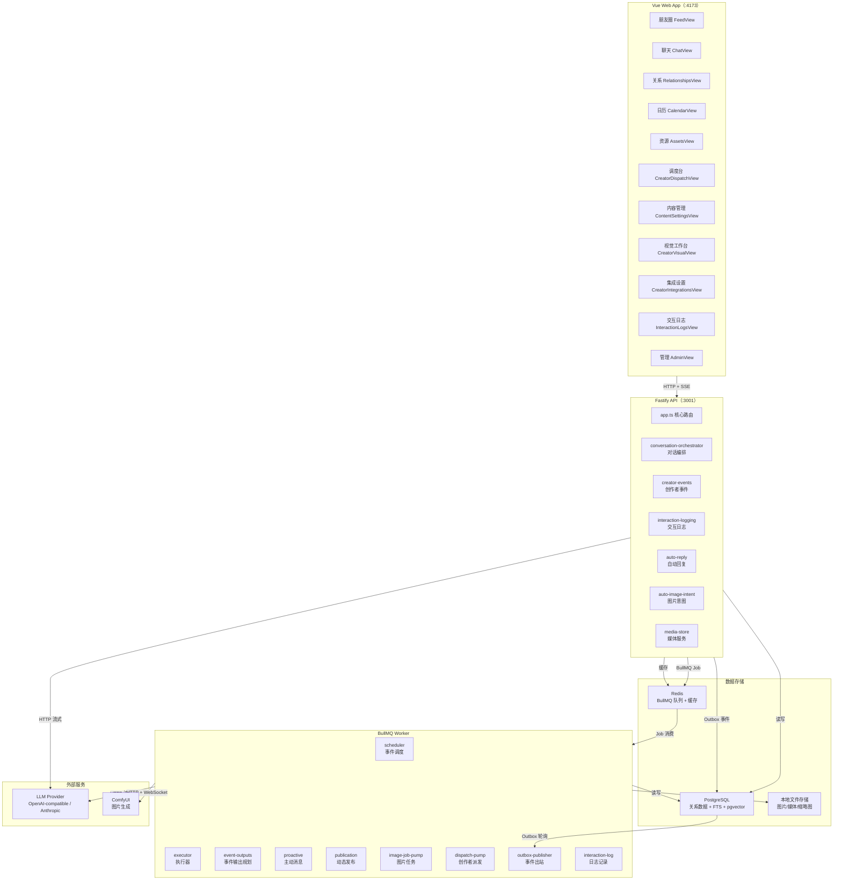
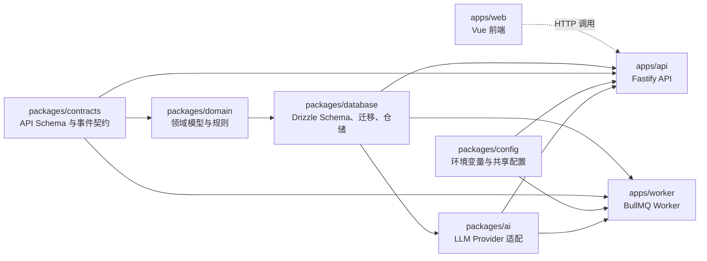
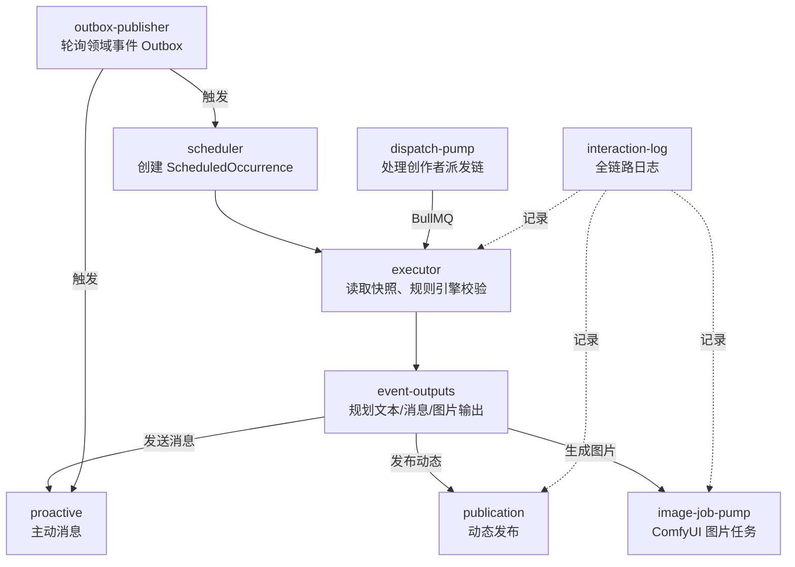

# Living Network 系统架构

## 概述

Living Network 是一个 AI 角色生活模拟与社交叙事系统，采用 TypeScript monorepo 架构。前端为 Vue 3 + Vite 单页应用，后端为 Fastify 模块化单体 API 加独立 BullMQ Worker，数据层使用 PostgreSQL（关系数据 + 全文检索 + pgvector）、Redis（队列与缓存）和本地文件存储，外部接入 OpenAI-compatible / Anthropic LLM 和 ComfyUI 图片生成服务。

## 整体架构

## 包依赖关系

## Worker 内部模块

## 数据存储

| 存储 | 内容 |
|------|------|
| **PostgreSQL** | 角色、关系、世界观、事件定义、调度执行、聊天消息、动态、记忆、交互日志、图片任务、创作者派发请求、LLM/ComfyUI 配置（加密）、视觉工作流模板、表情包 |
| **Redis** | BullMQ 任务队列（事件执行、图片生成、派发）、Worker 心跳、幂等键去重 |
| **本地文件系统** | ComfyUI 生成的原始图片、缩略图、表情包资源、媒体文件（`MEDIA_ROOT` 目录） |

## 外部服务集成

### LLM Provider

- **接入方式**：通过 `packages/ai/src/provider.ts` 统一适配，支持 OpenAI-compatible（含 DeepSeek、MiMo 等）和 Anthropic 原生 Messages API
- **配置方式**：Web 创作中心集成设置页可创建多个 LLM 档案，手动选择当前生效档案；API Key 以 AES-256-GCM 加密存入 PostgreSQL
- **降级策略**：未配置档案时回退到 `.env` 中的 `LLM_BASE_URL` / `LLM_MODEL` / `LLM_API_KEY`；LLM 不可用时聊天返回确定性占位回复，事件输出跳过 AI 生成改用系统通知

### ComfyUI

- **接入方式**：通过 HTTP 提交版本化 Workflow JSON，WebSocket 监听节点进度
- **配置方式**：Web 创作中心视觉设置页配置地址、超时、默认工作流版本；视觉工作流页管理与 ComfyUI 节点字段匹配的模板
- **降级策略**：ComfyUI 不可用时图片任务进入 FAILED 状态，支持手动重试；聊天和事件的文本功能不受影响
