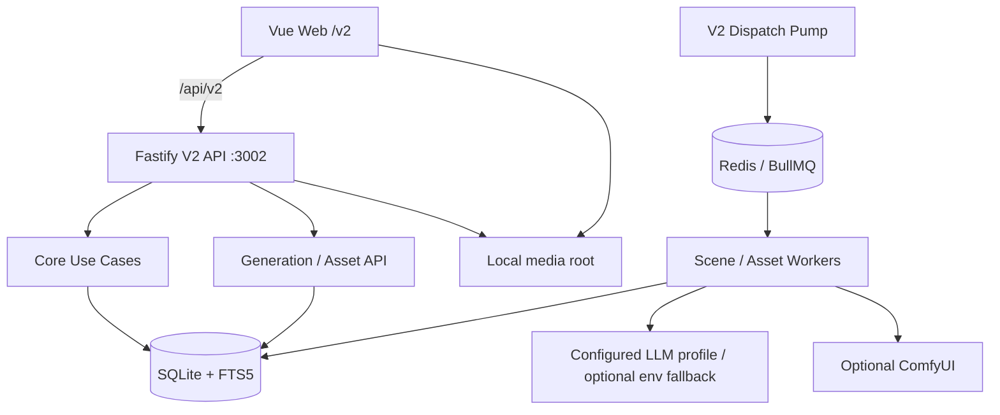

# Living Network 当前系统架构

最后核对：2026-08-14（`codex/v2-platform-workspace`）

本文是当前实现架构的唯一事实来源。V2 已正式接管应用运行时；V1 代码、PostgreSQL migration 和旧 API 只保留在工作树/归档分支中，等待后续独立物理删除任务，不属于当前产品运行时。

## 1. 当前运行时

Living Network 是 TypeScript monorepo，当前产品是本地优先的 AI 互动游戏创作、审核、发布和游玩系统：

- Vue 3 + Vite Web，默认入口 `/v2`；当前 Web 为中文单语言界面，不提供语言切换入口。
- Fastify V2 API，默认 `http://127.0.0.1:3002`，公共路径 `/api/v2`。
- 独立 V2 Worker，使用 BullMQ/Redis 派发长任务并回写 SQLite。
- Node.js 24 内置 `node:sqlite` + FTS5 作为唯一业务事实来源。
- 本地媒体根目录保存已批准资产；媒体只通过受控 `media://local/v2/assets/...` 引用访问。
- LLM、ComfyUI 和 Qdrant 都是可选外部适配器，默认关闭或未配置时不阻断 Core 编辑、发布和已发布游玩。



API 负责向上迁移和组装数据库；Worker 等待 API readiness，不执行 migration。Redis 只保存可重建的队列和派发运行状态，不能替代 SQLite 业务事实。

## 2. V2 模块边界

| 模块 | 当前职责 |
| --- | --- |
| `apps/web` | `/v2` 分组侧栏、创作工作区、模型/图片/外观配置、模型调用日志和触发器占位页 |
| `apps/api` | Fastify 路由、Parser、Use Case、Platform 配置 API、readiness/capabilities、Core/Generation/Media API |
| `apps/worker` | V2 任务派发、按能力绑定动态解析模型和图片服务、场景/资产 Worker、调用日志、有限重试、租约恢复和本地媒体落盘 |
| `packages/contracts` | V2 请求、响应、错误、Job、Candidate、Release、Runtime、平台配置和模型日志共享契约 |
| `packages/domain` | Canon、Narrative Graph、Typed State、Candidate Review、Release、Play Runtime 规则 |
| `packages/ports` | V2 仓储、快照、候选提交、资产、队列和平台配置/日志能力接口 |
| `packages/database` | SQLite 连接、顺序 migration、FTS5、V2 Core/Generation/Platform 仓储映射和事务边界 |
| `packages/ai` | V2 LLM provider、结构化场景候选解析、超时和错误归一化 |
| `packages/config` | V2 环境变量、SQLite/Redis/外部能力开关和安全边界 |

依赖方向保持：应用层依赖 Contracts、Domain 和 Ports；Database 实现 Ports；运行时入口负责装配 Database、AI 和外部适配器。`packages/domain` 不依赖 HTTP、数据库、队列、供应商 SDK、Vue 或 `packages/ports`。

## 3. API 调用路径

```text
Fastify route
  -> Parser
  -> Use Case
  -> Port
  -> SQLite/Redis/外部 Adapter
```

Core 分组覆盖 World Canon、Graph、Typed State、Candidate Review、Release、Runtime/Save/Export；Generation 分组覆盖上下文预览、场景 Job、资产 Job 和资产候选审核；Platform 分组提供 health、ready、capabilities、模型档案/能力绑定、图片服务、外观主题、模型调用日志和受控媒体访问。

Platform 的模型解析顺序固定为“场景生成能力绑定的模型档案 → 环境变量中的完整兜底配置 → 明确的配置错误”。模型 API 密钥通过 `INTEGRATION_SECRET_KEY` 使用 AES-256-GCM 加密后写入 SQLite，公共 API 只返回 `hasApiKey`，不返回密钥明文。Worker 每次任务执行时重新读取绑定和档案，因此 Web 修改配置后不需要重启 Worker。

Core 写入使用 revision/idempotency 保护。AI/ComfyUI 输出先进入 Job 或 Candidate，只有创作者审核后的内容才能进入 canon 或 release。Runtime 只读取不可变 release 和 save，不读取 pending 工作区候选。

## 4. 数据与异步边界

SQLite 保存世界、图、状态 schema、候选、审核、发布包、运行、存档、任务、平台设置和模型调用日志事实；FTS5 只用于本地关键词检索。平台迁移 `0200_v2_platform_configuration` 保存模型档案/能力绑定、图片服务和外观设置，`0201_v2_model_call_logs` 保存脱敏后的模型请求与响应。模型日志默认由 Worker 清理 30 天前记录，并在启动时把长时间未完成的调用标记为 interrupted。媒体文件在 `V2_MEDIA_ROOT/v2/assets` 下按内容哈希保存。Redis/BullMQ、Qdrant 均为可重建派生状态。

每个长任务必须有稳定幂等键、有限重试、租约恢复和明确终态。派发泵从 SQLite outbox 读取 pending 记录，入队成功后标记 enqueued；入队失败保留 pending 并记录错误。Worker 不能绕过 Candidate/Domain 直接写最终 canon。

## 5. 部署与验证

```sh
pnpm --filter @living-network/api dev:v2
pnpm --filter @living-network/web dev
pnpm --filter @living-network/worker start:v2
```

持久本地栈使用 `infra/compose/docker-compose.yml` 的 `api`、`worker`、`redis`、`web` 四个服务，SQLite、Redis 和媒体分别使用命名卷。启动后在 Web 的“平台配置”中填写模型和图片服务；只有需要环境变量兜底或加密密钥时才配置 `.env` 中的对应项。核心检查：

```sh
curl http://127.0.0.1:3002/api/v2/ready
pnpm check:boundaries
pnpm typecheck
pnpm test
pnpm test:coverage
pnpm build
```

真实 Redis、LLM、ComfyUI 和 Qdrant 必须单独启用并单独报告；Fake/SQLite 通过不等于真实服务已验收。

## 6. V1 退役状态

V1 已冻结并停止作为默认入口、CI 和运行时。归档分支 `archive/v1-final` 指向 `96130c5e37e83fddfe3e2c252a46c3ca0d17a340`，用于必要时回滚和历史查询。当前切换未删除 V1 PostgreSQL/Redis 数据、migration 或工作树代码；物理删除和数据生命周期处理必须作为后续有明确批准的独立任务。

历史 V1 文档和 delivery 记录保留为历史证据，不得用来描述当前运行方式。
