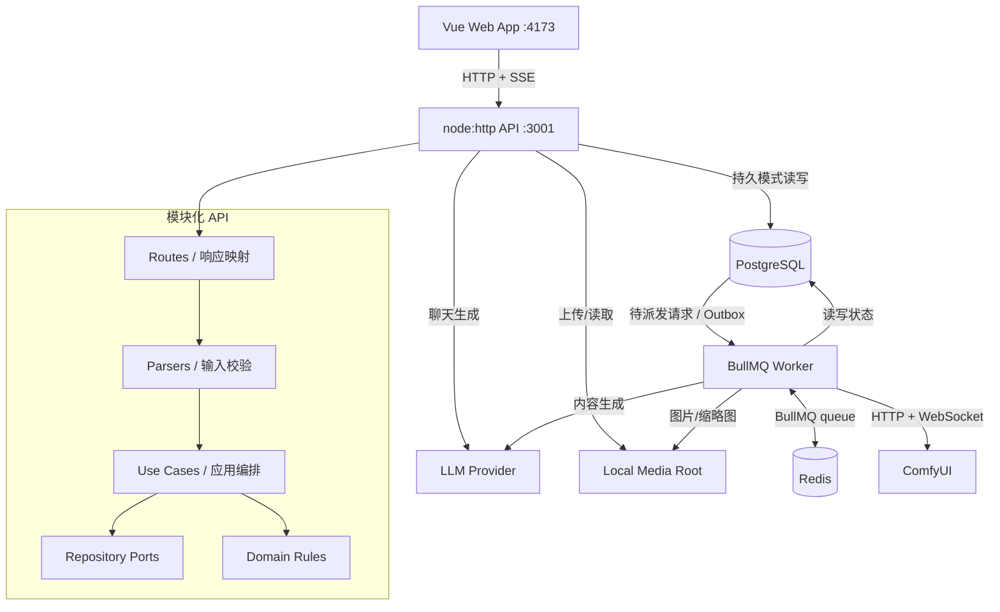
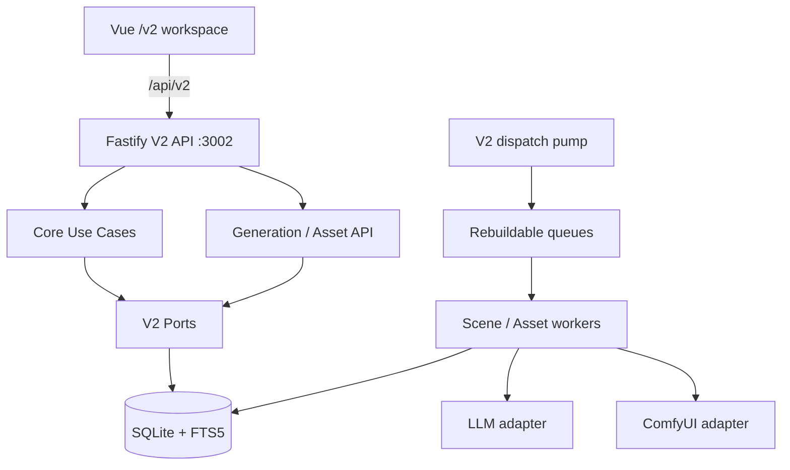
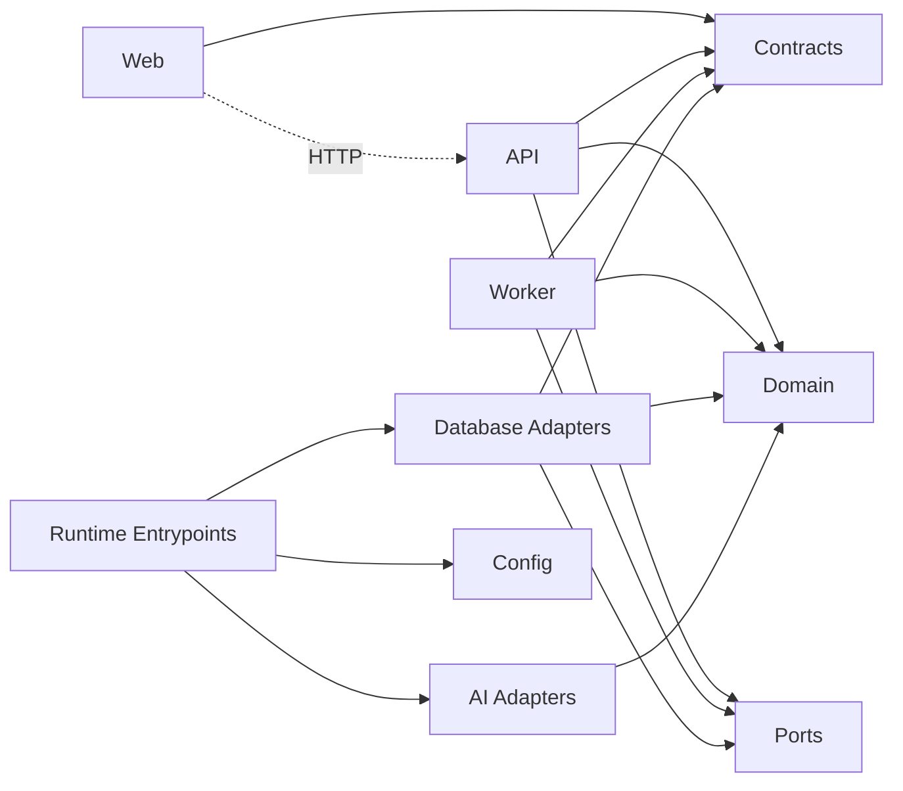
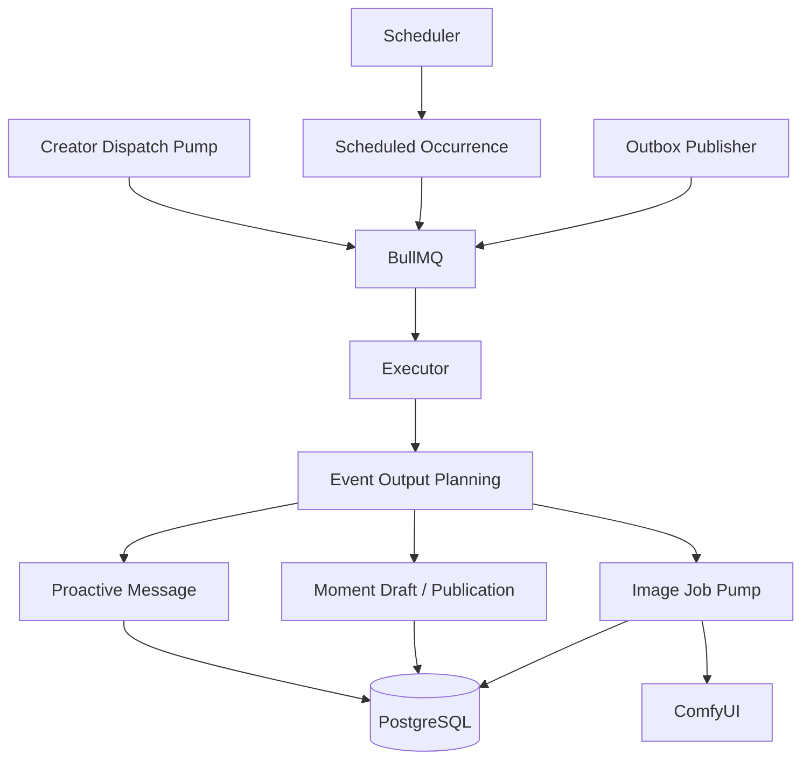

# Living Network 当前系统架构

最后核对：2026-08-12（V2 集成分支）

本文是当前实现架构的唯一文档事实来源。长期原则见 [DEVELOPMENT.md](./DEVELOPMENT.md)，能力完成状态见 [PROGRESS.md](./PROGRESS.md)，架构选择原因见 [decisions/](./decisions/)。

## 1. 系统概述

Living Network 是 TypeScript monorepo。当前 V1 与 V2 replacement 在同一仓库并存：V1 保留原有角色生活模拟与社交叙事能力，V2 提供本地优先的互动游戏创作、审核、发布与游玩闭环。

V1 当前由以下部分组成：

- Vue 3 + Vite 单页 Web 应用。
- 基于 Node.js `node:http` 的模块化单体 API。
- 独立 BullMQ Worker，负责调度、事件执行、主动消息、图片任务、发布和 Outbox。
- PostgreSQL 持久化、Redis/BullMQ 队列、本地媒体文件存储。
- OpenAI-compatible / Anthropic LLM 和 ComfyUI 外部适配器。
- 无外部服务依赖的内存开发模式，以及 PostgreSQL + Redis 的持久模式。

V1 不使用 Fastify、Drizzle、TypeBox、pgvector、Turborepo 或完整 OpenTelemetry。V2 已按 ADR-0006 使用 Fastify 与 Node 24 内置 SQLite；这不改变 V1 的默认技术边界。

## 2. 运行时架构



API 不直接依赖 BullMQ。创作者正式派发先把请求写入 PostgreSQL，Worker 的派发泵读取请求并加入 BullMQ；队列消费后更新执行和批次状态。Redis 不承担业务事实的唯一存储。

### 2.1 V2 replacement 运行时



V2 的正常本地入口为 `pnpm --filter @living-network/api dev:v2`，默认监听 `127.0.0.1:3002`，SQLite 文件默认位于 `.data/living-network-v2.sqlite`；Web 开发服务器把 `/api/v2` 代理到该入口。`V2_SQLITE_PATH=:memory:` 可用于一次性测试。启动时只执行向上的顺序 migration，并在同一事务中登记 migration。

V2 composition root 同时装配 Core 与 Generation/Assets SQLite 仓储。Core 的运行时只读取不可变 release 与 save；生成上下文通过 `CanonSnapshotReaderPort` 读取明确 revision，Worker 只能通过 `CandidateSubmissionPort` 提交 pending scene candidate。V2 dispatch pump、场景 Worker 和资产 Worker 已实现为可注入单元，但真实 Redis、LLM 与 ComfyUI 的进程级启动和验收仍是显式部署工作；它们不可用时不影响离线编辑、发布和游玩。

## 3. 代码与依赖边界

| 模块 | 当前职责 |
| --- | --- |
| `apps/web` | Vue 页面、路由、Pinia 状态、API 客户端和主题系统 |
| `apps/api` | HTTP/SSE 适配、输入解析、Use Case、对话编排、身份上下文和运行时组装 |
| `apps/worker` | Scheduler、Executor、BullMQ、Outbox、主动消息、动态和图片处理 |
| `packages/contracts` | Web/API/Worker 共享 DTO、枚举、ID 和请求响应类型 |
| `packages/domain` | 无框架领域实体、状态机、校验和业务规则 |
| `packages/ports` | 仓储、Outbox、派发和交互日志等应用接口 |
| `packages/database` | 内存仓储、PostgreSQL 仓储、手写 SQL、迁移和数据库映射 |
| `packages/ai` | OpenAI-compatible / Anthropic Provider、流式协议、超时和错误归一化 |
| `packages/config` | 环境变量解析、秘密边界和功能开关 |

目标依赖方向：



当前 API/Worker 仍有从 Database 兼容导出获取 Ports 类型的代码，`DomainRepositories` 也仍是较大的 Repository Bag；它们是已知技术债务，不是新代码应复制的模式。

## 4. API 组织

API 的标准调用路径是：

```text
node:http server
  -> app 路由分发
  -> routes（HTTP 方法、路径、状态码）
  -> parsers（请求形状与字段校验）
  -> use-cases（应用编排、权限与事务边界）
  -> ports（仓储能力）
  -> domain（领域规则）
```

`app.ts` 负责上下文组装和路由分发，不应重新承载已提取的业务逻辑。共享请求/响应类型来自 Contracts；运行时解析仍由显式解析器和领域断言完成。

主要 API 能力包括世界与角色、关系、ActorSession、聊天与 SSE、动态、事件与日历、视觉工作流、图片任务、贴纸、创作者派发、集成设置、交互日志、Story Graph 内容管理、Story Generation Job/Candidate、Relationship Feedback 和 Social Feed。

近期实现已经把部分 Parser、Contract Schema、SQL 仓储和内存仓储拆到业务域文件，并新增 Story Generation、Moment Draft Review、Relationship Feedback、Social Feed 和评论自动回复入口。但这些新增入口仍属于当前 V1 架构内的增量能力，不等于 V2 产品架构已经落地。

## 5. 领域与内容模型

核心领域分为：

- 世界与身份：`StoryWorld`、`Character`、`ActorSession`、`RelationshipEdge`。
- 对话与记忆：`Conversation`、`Message`、`MemoryItem` 和可见性规则。
- 事件与生活模拟：事件定义、Occurrence、Plan、Execution、Behavior Action 和主动消息预算。
- 动态与媒体：Moment Draft、Moment、互动、Image Job、视觉身份、Workflow 和贴纸。
- 故事图：Story Arc、Story Node、Story Edge、Prompt Template 和 Memory Candidate。
- 生成与反馈：World Context Policy、Story Generation Job/Candidate、Relationship Change Candidate/Event、Social Feed Event 和评论自动回复触发。

Story Graph 当前支持剧情弧、节点、边、Prompt 预览和记忆候选审核，并同时具备内存与 PostgreSQL 仓储。它属于内容管理能力，尚不意味着模型已经能自动推进完整剧情状态机。

Story Generation 当前已有 Job/Candidate 的 Domain、Contracts、API 和仓储基础，但缺少 Worker 消费者来实际调用模型生成内容。Relationship Feedback、Moment Draft Review 与 Social Feed 的部分 Use Case 仍存在多次写入不在同一事务边界的问题，不能把它们视为已完成的强一致闭环。

## 6. 数据存储

### PostgreSQL

持久化以下事实：

- 世界、角色、关系和 ActorSession。
- 会话、消息、记忆和 PostgreSQL FTS 索引。
- 世界资料、事件、日程、执行、行为和主动消息预算。
- 动态草稿、动态、互动、图片任务和视觉工作流。
- Story Graph、Prompt Template 和 Memory Candidate。
- LLM/ComfyUI 设置、交互日志、派发请求、Worker 心跳和 Outbox。

数据库通过顺序 SQL migration 演进，仓储由 `pg` 和手写 SQL 实现。多数幂等约束、审计和执行终态位于 PostgreSQL。

### Redis

Redis 用于 BullMQ 任务队列及其可重建运行数据。当前主要覆盖 Occurrence、Outbox 等队列；创作者派发请求和 Worker 心跳实际保存在 PostgreSQL。不能把不可恢复的业务记录只保存在 Redis。

### 本地文件系统

`MEDIA_ROOT` 保存上传媒体、ComfyUI 输出和缩略图。Compose 中包含 MinIO，但当前应用媒体适配器仍以本地文件系统为主，不能将“基础设施可启动”表述为“对象存储适配已完成”。

## 7. Worker 与异步一致性



任务必须有稳定幂等键、有限重试和明确终态。数据库写入与 Outbox 需要保持事务边界；发布或图片失败不能伪装为成功，也不能因重放产生重复消息、动态或图片。

## 8. 外部服务与信任边界

### LLM

- 支持 OpenAI-compatible 和 Anthropic Messages 协议。
- 活跃模型档案可加密存入 PostgreSQL；环境变量可作为回退配置。
- Provider 负责认证、协议、流式解析、超时、错误归一化和观测钩子。
- 模型输出只是文本或候选，不可直接成为未经校验的业务事实。
- 默认自动测试使用 Fake/注入 Fetch，不访问真实供应商。

### ComfyUI

- 使用 HTTP 提交版本化 Workflow，WebSocket/历史查询跟踪进度和终态。
- Worker 校验输出、下载媒体并关联消息或动态。
- 不可用时图片任务进入失败/可重试路径，不应阻断文本能力。
- 真实实例验收与本地 Fake/WebSocket 测试必须分别报告。

## 9. 两种运行模式

### 内存开发模式

API 使用显式 Seed 和内存仓储，适合无 Docker 的 UI、API 和领域开发。它可以验证多数 CRUD、预览和对话行为，但不证明持久化、BullMQ 或重启恢复有效，且不能正式派发创作者事件。

### 持久模式

API 使用 PostgreSQL 仓储，Worker 使用 PostgreSQL + Redis。正式创作者派发、Outbox、队列消费和持久媒体链路需要该模式。真实 LLM 与 ComfyUI 仍需单独配置和验收。

## 10. 已知架构债务

- Database 仍兼容导出部分 Ports 类型；API/Worker 业务代码尚未完全改为直接面向 Ports。
- `DomainRepositories` 可选能力较多，Use Case 尚未全部收敛到最小能力接口。
- SQL、内存仓储、Contracts Schema、Parser 和部分 Vue 页面已经开始拆分，但仍存在较大 façade、Repository Bag 和历史页面债务。
- 前端规范中的基础组件和语义令牌要求尚未被自动门禁完整覆盖，且存在历史违规。
- Web API 客户端已经统一为 `api.ts`，旧 `api.js` 与 `api.d.ts` 已删除；后续不得重新引入双份维护。
- `pnpm verify` 当前不包含 `pnpm test:coverage`；覆盖率门槛不能被描述为 verify 已强制执行。
- Story Generation 缺少 Worker 消费者；评论自动回复和部分候选审核路径仍需补强运行时校验、事务边界和专项测试。
- 生产级认证、TLS、集中秘密管理、对象存储适配和完整可观测部署尚未完成。

这些事项需要独立任务处理，不能在无关功能中顺带重构。
