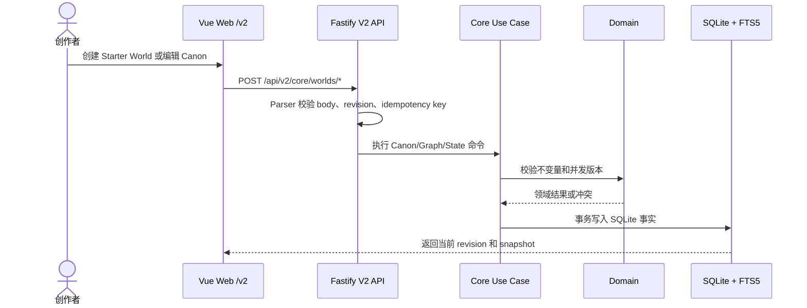
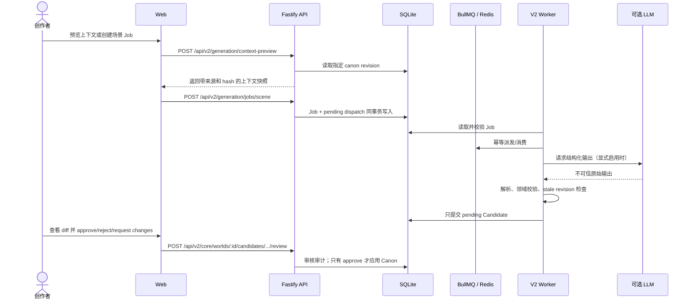
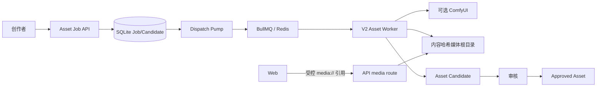
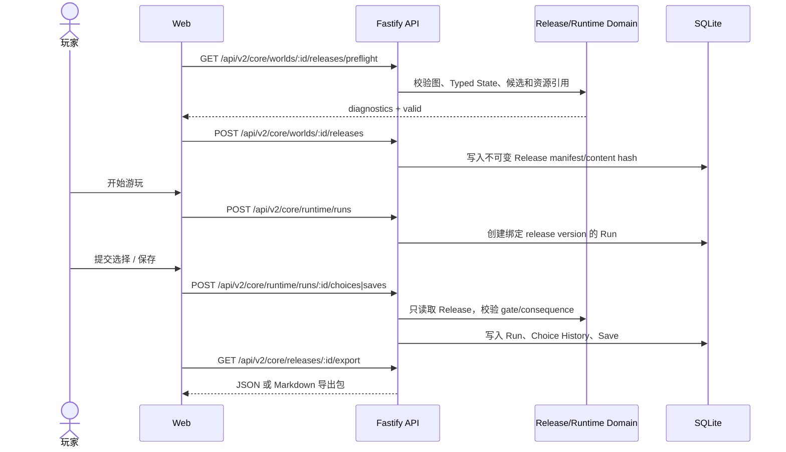

# Living Network V2 当前核心业务流程

最后核对：2026-08-13

本文描述当前 V2 已实现的创作者、生成审核、发布和游玩路径。系统边界以 [architecture.md](./architecture.md) 为准；外部服务只在显式配置后调用。旧 V1 社交模拟流程保留在归档资料中，不属于当前产品流程。

## 1. 创建和编辑本地世界

World Canon、角色、地点、事实、规则、Narrative Graph 和 Typed State 都写入同一个 SQLite 事实库。FTS5 只提供可重建的本地关键词检索；Redis 不参与业务事实写入。

## 2. 生成候选和审核应用

LLM 未配置时，Core 编辑、Release 和已发布游玩仍可用；生成端点返回能力不可用或使用测试替身，不得绕过 Candidate/Review 边界直接写入 Canon。

## 3. 资产生成和受控媒体

资产输出必须经过协议、大小、内容类型、哈希和路径校验。Web 只访问 `/api/v2/media/assets/<hash>.<ext>`，不直接访问 ComfyUI；失败任务进入有限重试和明确终态。

## 4. 发布、游玩、保存和导出

Pending Candidate 不会进入 Player Runtime。修改工作区不会改变旧 Release 或绑定该 Release 的 Save；运行时只接受固定 Release 版本。

## 5. 外部能力和运行边界

- API 启动时执行 V2 SQLite up migration；Worker 等待 `/api/v2/ready`，不执行 migration。
- Redis 只保存可重建队列和派发状态，队列丢失后可从 SQLite pending dispatch 重建。
- 场景生成、资产生成、LLM、ComfyUI 和 Qdrant 默认关闭或未接入；真实服务验收必须显式启用并单独记录。
- V1 PostgreSQL、旧 `/v1` API、旧 Worker 和旧 Web 流程已冻结，不参与当前默认入口、Compose 或 CI。
