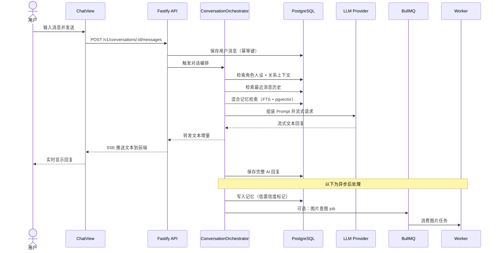
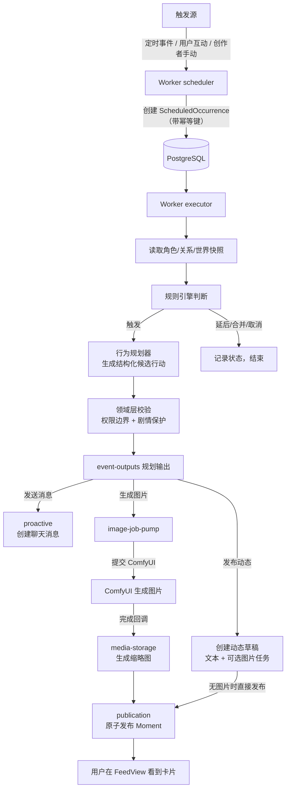
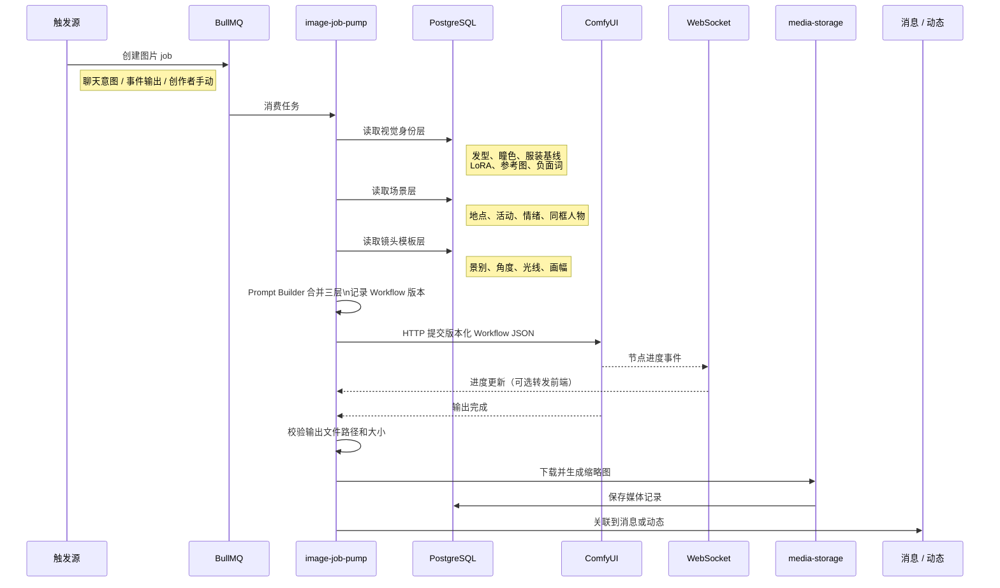
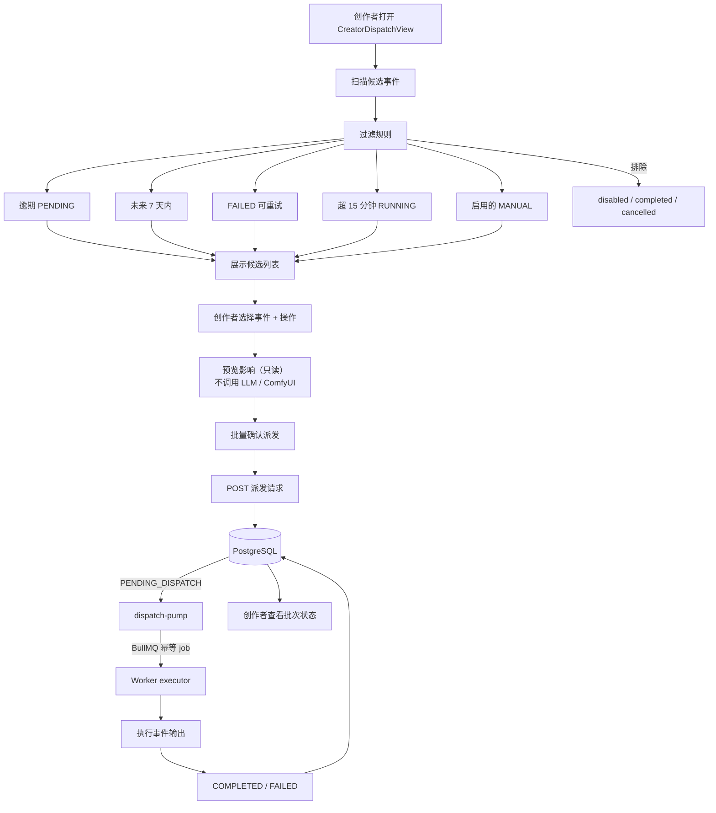
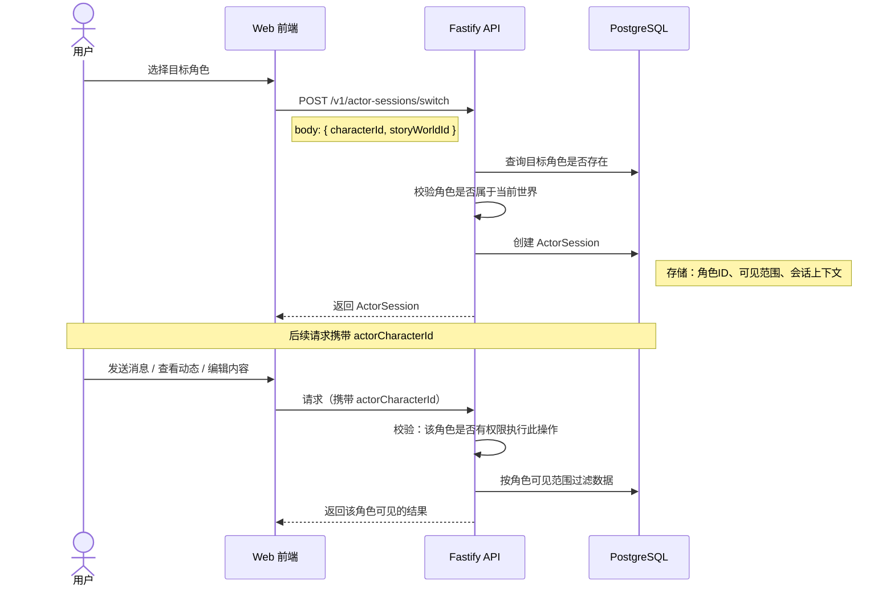

# Living Network 核心业务流程

本文档梳理系统 5 条核心用户路径，展示从用户操作到系统响应的完整链路。实线箭头表示同步调用，虚线箭头表示异步/延迟处理。

## 1. 聊天交互

用户在私聊中发送一条消息，经过记忆检索和 LLM 生成后流式返回回复，同时异步写入记忆并可选触发图片生成。

**关键节点：**
- 幂等键防止重复消息
- 记忆检索三路召回：关键词（FTS）、向量（pgvector）、实体关系，用 RRF 融合
- 图片意图不阻塞文本回复，走异步队列

## 2. 朋友圈动态

事件触发后，Worker 完成从调度到发布的全链路，用户在 Feed 页看到新动态卡片。

**关键节点：**
- 每个环节都有幂等键，重放不会产生重复动态
- 关闭动态关系开关后，整条链路不修改关系状态
- 图片完成后才原子发布，避免出现无图动态

## 3. 图片生成

无论触发源是什么，图片任务都经过统一的三层 Prompt 组装和 ComfyUI 提交流程。

**关键节点：**
- 三层 Prompt 分离保证角色视觉一致性：身份层（稳定）+ 场景层（变化）+ 镜头层（构图）
- ComfyUI 输出限制在配置目录，服务端验证路径穿越
- 不直接用自由文本维持角色一致性

## 4. 创作者事件派发

创作者通过调度台批量管理待处理事件，系统扫描候选、预览影响后执行派发。

**关键节点：**
- 扫描是纯本地计算，不调用外部服务
- 预览是只读的，不会触发 LLM 或 ComfyUI
- 内存模式支持扫描和预览，但禁用正式派发

## 5. 角色切换

用户在不同角色间切换，改变自己在世界中的身份、可见范围和互动权限。

**关键节点：**
- 角色切换不是身份认证，远程部署前需额外增加认证层
- 所有写操作必须携带 actorCharacterId，服务端强制校验
- 可见范围影响：聊天身份、动态可见性、关系查询范围、记忆检索范围
