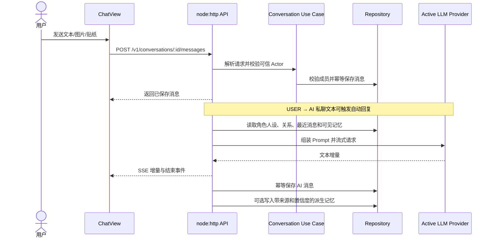
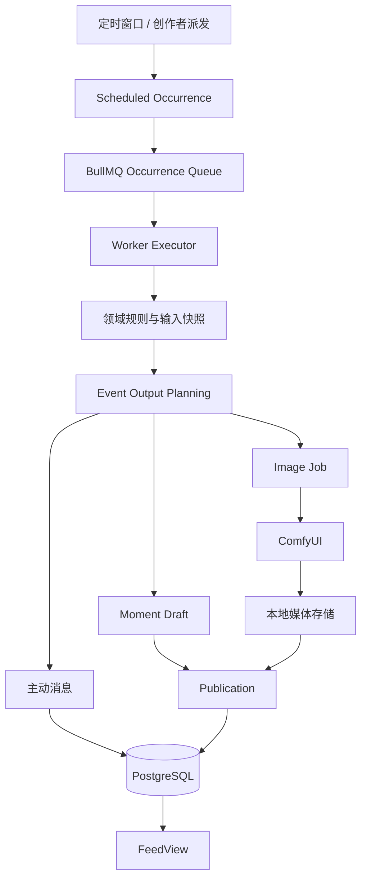
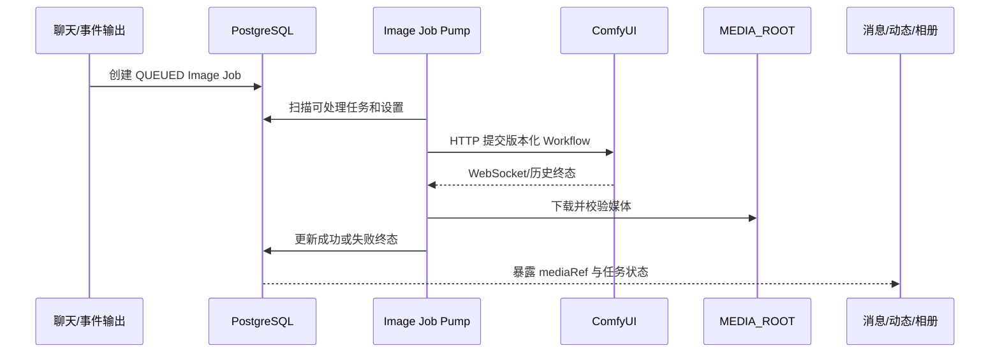
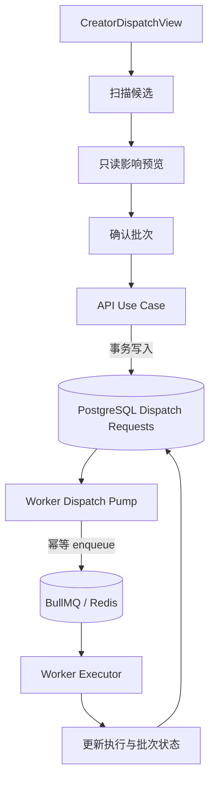
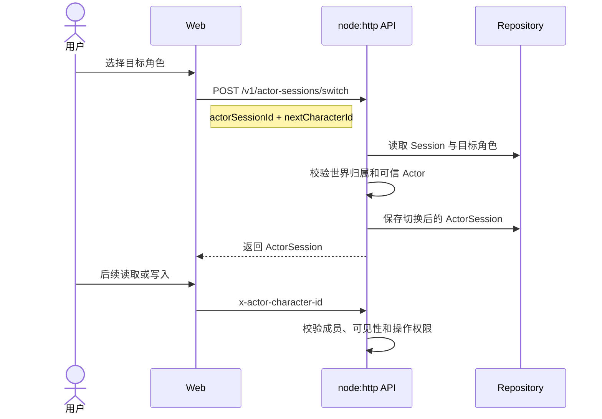
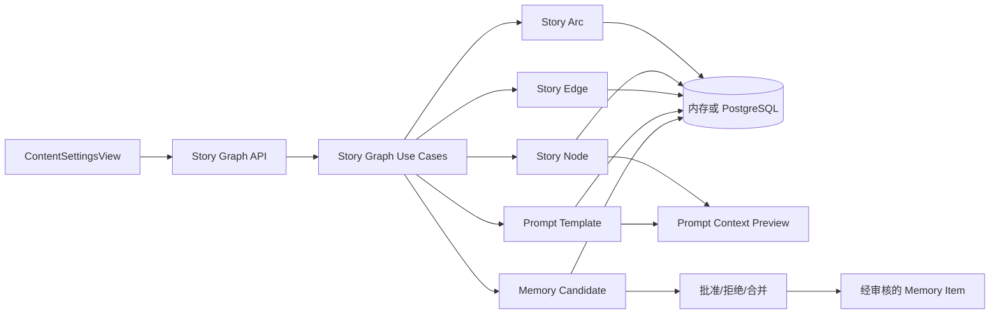

# Living Network 当前核心业务流程

最后核对：2026-08-12

本文描述当前已实现的主要用户路径。产品愿景见 [product-requirements.md](./product-requirements.md)，系统边界见 [architecture.md](./architecture.md)。图中的外部服务仅在显式配置后调用。

## 1. 私聊与模型回复

当前记忆检索使用内存关键词匹配或 PostgreSQL FTS，不包含 pgvector 或 RRF。模型不可用时保留用户消息并提供显式失败/重试路径；默认自动测试不访问真实模型。

## 2. 定时事件与动态输出

Occurrence、Execution、消息、动态和图片任务分别持有幂等标识。是否立即发布、等待图片或进入人工审核由领域状态与功能开关决定；不能把规划中的“原子发布”当作所有输出都已具备同一事务的证明。

## 3. 聊天与事件图片

角色视觉身份、场景 Prompt、负面词和 Workflow 绑定共同构成图片请求。Worker 校验协议与输出，失败进入可观察、可重试状态；浏览器不直接访问 ComfyUI。

## 4. 创作者事件派发

内存模式支持扫描与预览，不允许正式派发。持久模式要求 PostgreSQL、Redis 和活跃 Worker；API 本身不直接调用 BullMQ，Redis 不可用时请求仍保留在 PostgreSQL 中等待恢复。

## 5. 角色切换与可信 Actor

角色切换只表达世界内身份。生产或远程部署仍需真实认证代理，并把外部用户映射到允许扮演的角色。

## 6. Story Graph 创作工作区

当前能力是编辑、校验、持久化、Prompt 上下文预览和记忆候选审核。预览不会调用模型；自动生成剧情正文、推进节点或把模型建议直接应用到世界状态尚未实现。
